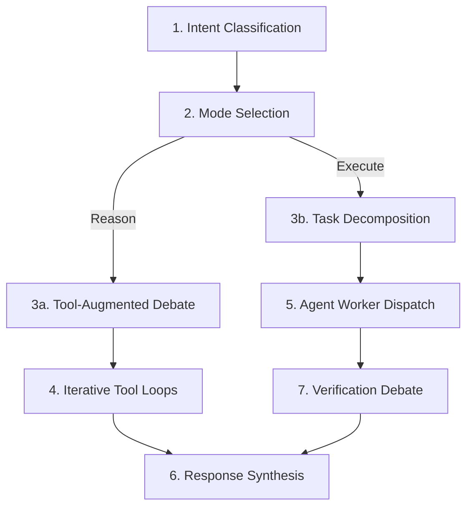

# Agentic Ensemble Architecture

## Overview

The AgenticEnsemble is a dual-mode unified LLM execution engine that extends HelixAgent's multi-provider debate system with autonomous tool integration and task execution. It operates in two modes:

- **Reason Mode** (`AgenticModeReason`): Tool-augmented reasoning where the ensemble debate accesses MCP, LSP, RAG, Embeddings, Vision, and HelixMemory during deliberation but does not execute side effects.
- **Execute Mode** (`AgenticModeExecute`): Full autonomous task execution where debate decisions are decomposed into tasks, dispatched to background agent workers, and verified through a post-execution debate.

Both modes are exposed through the existing OpenAI-compatible endpoint (`POST /v1/chat/completions`) and the agentic workflow endpoint (`POST /v1/agentic/workflows`).

## Request Flow (7 Stages)

| Stage | Component | Description |
|-------|-----------|-------------|
| 1. Intent Classification | `LLMIntentClassifier` | Determines whether the request requires reasoning only or autonomous execution |
| 2. Mode Selection | `AgenticEnsemble` | Selects `AgenticModeReason` or `AgenticModeExecute` based on classification |
| 3a. Tool-Augmented Debate | `DebateService` + `ToolIntegration` | Multi-provider debate with per-phase tool access across 6 protocols |
| 3b. Task Decomposition | `ExecutionPlanner` | LLM-based decomposition into `AgenticTask` list with dependency graph |
| 4. Iterative Tool Loops | `ToolIntegration` | Per-phase iterative tool invocation (MCP, ACP, LSP, RAG, Embeddings, Vision) |
| 5. Agent Worker Dispatch | `AgentWorkerPool` | Semaphore-limited parallel task execution respecting dependency layers |
| 6. Response Synthesis | `AgenticEnsemble` | Aggregates results from all agents/debate phases into final response |
| 7. Verification Debate | `VerificationDebate` | LLM-based quality check evaluating completeness, correctness, and coherence |

## Component Descriptions

### AgenticEnsemble

The top-level orchestrator in `internal/services/`. It holds references to the `ExecutionPlanner`, `VerificationDebate`, tool integration, and configuration. The `Process` method is the main entry point: it classifies intent, selects mode, runs the appropriate pipeline, and returns an `AgenticMetadata`-annotated response.

### ExecutionPlanner

`internal/services/execution_planner.go` -- Uses an LLM to decompose a debate decision into structured `AgenticTask` objects. Each task carries an ID, description, dependency list, tool requirements, priority, and estimated step count. The `BuildDependencyGraph` method applies Kahn's algorithm for topological layering, detecting circular dependencies and grouping independent tasks for parallel execution.

### AgentWorkerPool

A semaphore-limited pool that spawns background agent goroutines. Concurrency is bounded by `MaxConcurrentAgents` (default: 5). Workers execute tasks layer by layer -- all tasks in a dependency layer run in parallel, and the pool waits for the layer to complete before advancing to the next. Each worker has its own `AgentTimeout` (default: 5 min).

### VerificationDebate

`internal/services/verification_debate.go` -- Post-execution quality gate. Constructs a verification prompt from all `AgenticResult` summaries and the original request, then calls an LLM to evaluate completeness, correctness, and coherence. Returns `AgenticVerificationResult` with approval status, confidence score, and issue list. Falls back to low-confidence pass (0.5) when the LLM is unavailable, so the pipeline degrades gracefully rather than hard-failing.

### ToolIntegration

`internal/debate/tools/tool_integration.go` -- Unified access layer for all 8 tool protocols. Provides typed clients for MCP, ACP, LSP, Embeddings, RAG, Formatters, Vision, and HelixMemory. Each client is nil-safe: unavailable protocols return a descriptive error rather than panicking. The `ListAvailableTools` method aggregates capabilities across all configured clients.

## Power Feature Integration Matrix

| Protocol | Reason Mode | Execute Mode | Interface |
|----------|:-----------:|:------------:|-----------|
| MCP | Yes | Yes | `MCPClient` -- `CallTool`, `ListTools`, `GetResource` |
| ACP | Yes | Yes | `ACPClient` -- `SendMessage`, `Subscribe` |
| LSP | Yes | Yes | `LSPClient` -- `GetDefinition`, `GetReferences`, `GetDiagnostics`, `Format` |
| RAG | Yes | Yes | `RAGClient` -- `Search`, `Store`, `Rerank` |
| Embeddings | Yes | Yes | `EmbeddingClient` -- `Embed`, `EmbedBatch`, `Similarity` |
| Vision | Yes | Yes | `VisionClient` -- `AnalyzeImage`, `AnalyzeURL` |
| HelixMemory | Yes | Yes | `HelixMemoryClient` -- Mem0 facts, Cognee graphs, Letta sessions, Graphiti timeline |
| Formatters | Yes | Yes | `FormatterRegistry` -- `Format`, `ListFormatters` |

## Configuration Reference

All fields are in `AgenticEnsembleConfig` (`internal/services/agentic_ensemble_types.go`).

| Field | Type | Default | Description |
|-------|------|---------|-------------|
| `MaxConcurrentAgents` | `int` | 5 | Maximum parallel agent workers |
| `MaxIterationsPerAgent` | `int` | 20 | Maximum LLM reasoning steps per agent |
| `MaxToolIterationsPerPhase` | `int` | 5 | Maximum tool invocation loops per debate phase |
| `AgentTimeout` | `time.Duration` | 5 min | Per-agent execution timeout |
| `GlobalTimeout` | `time.Duration` | 15 min | Overall pipeline timeout |
| `ToolIterationTimeout` | `time.Duration` | 30 sec | Timeout for a single tool invocation |
| `EnableVision` | `bool` | true | Enable Vision protocol |
| `EnableMemory` | `bool` | true | Enable HelixMemory 4-engine access |
| `EnableExecution` | `bool` | true | Enable Execute mode (false restricts to Reason only) |

Environment variable overrides follow the pattern `AGENTIC_<FIELD>`, e.g., `AGENTIC_MAX_CONCURRENT_AGENTS=10`.

## Error Handling Summary

| Failure | Behavior |
|---------|----------|
| LLM decomposition fails | `ExecutionPlanner.DecomposePlan` returns wrapped error; pipeline aborts |
| Circular task dependency | `BuildDependencyGraph` returns error before any workers spawn |
| Unknown task dependency | Detected during graph build; returns descriptive error |
| Individual agent timeout | `AgenticResult.Error` set; other agents continue |
| All agents fail | `VerificationDebate` short-circuits with `Approved: false`, confidence 0.0 |
| Verification LLM unavailable | Defaults to `Approved: true`, confidence 0.5 with caveat |
| Global timeout exceeded | Context cancellation propagates to all agents and tool calls |
| Tool protocol unavailable | Nil-safe clients return descriptive error; agent continues without that tool |

## Key Files

- `internal/services/agentic_ensemble_types.go` -- Types, enums, config, defaults
- `internal/services/execution_planner.go` -- Task decomposition and dependency graph
- `internal/services/verification_debate.go` -- Post-execution verification debate
- `internal/debate/tools/tool_integration.go` -- Unified 8-protocol tool access
- `internal/handlers/openai_compatible.go` -- `processWithEnsemble` entry point
- `challenges/scripts/agentic_ensemble_challenge.sh` -- 32-test validation script
