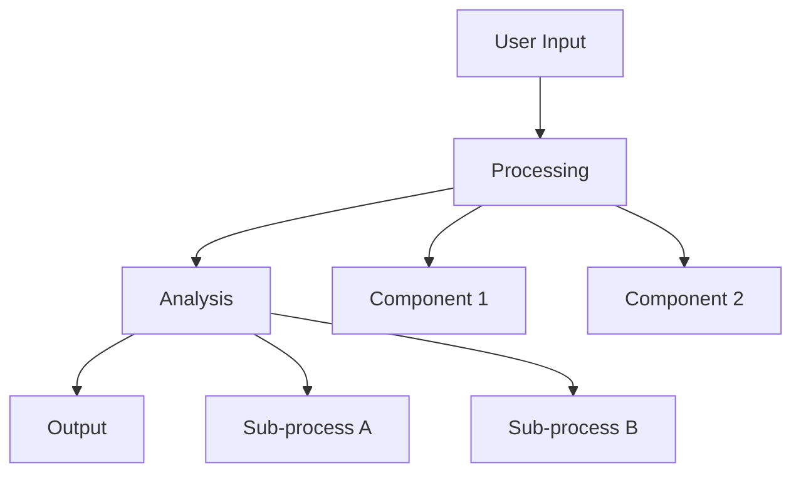
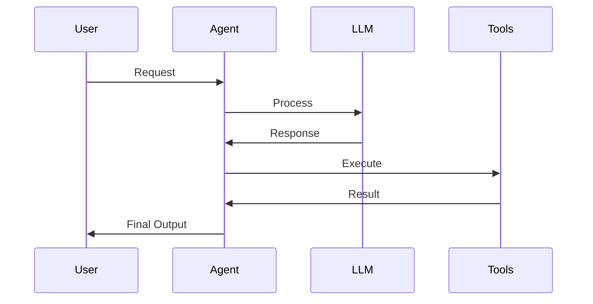
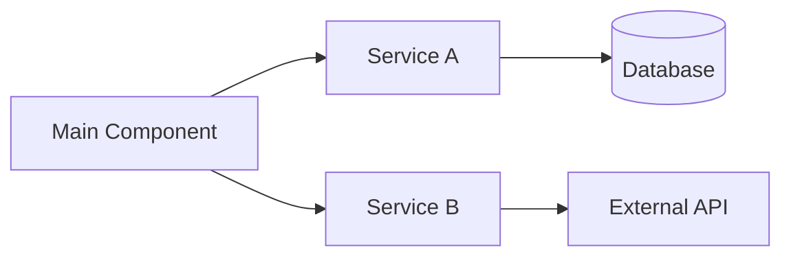

# Codai - Architecture Diagrams

## System Architecture

```mermaid
graph TB
    A[User Input] --> B[Processing]
    B --> C[Analysis]
    C --> D[Output]
    
    B --> E[Component 1]
    B --> F[Component 2]
    
    C --> G[Sub-process A]
    C --> H[Sub-process B]
```

## Data Flow

```mermaid
sequenceDiagram
    participant User
    participant Agent
    participant LLM
    participant Tools
    
    User->>Agent: Request
    Agent->>LLM: Process
    LLM->>Agent: Response
    Agent->>Tools: Execute
    Tools->>Agent: Result
    Agent->>User: Final Output
```

## Component Interaction

```mermaid
graph LR
    A[Main Component] --> B[Service A]
    A --> C[Service B]
    B --> D[(Database)]
    C --> E[External API]
```

---

*Last Updated: 2026-04-04*
