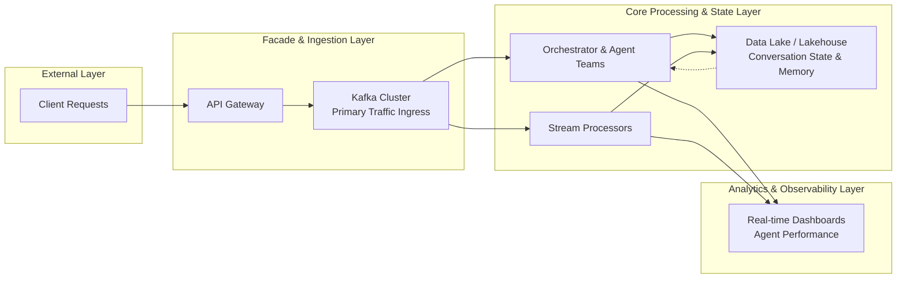
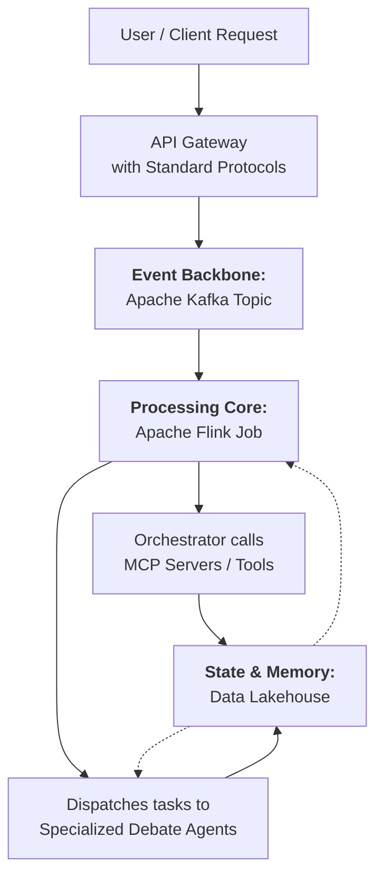

For your specific goal of building an LLM agent facade for AI debate teams, integrating big data technologies is a strategic move to ensure scalability, maintain state, and enable advanced orchestration. The primary benefits are resilient traffic handling, persistent conversational memory, and intelligent agent coordination.

Here is a technical blueprint for incorporating them into your facade architecture:

🗺️ Architectural Integration Points

Your facade sits between external API calls and your internal agent teams. Big data tech integrates at three critical layers:

1. The Ingestion & Routing Layer (Kafka)

· How: Place an Apache Kafka cluster as the primary ingress point behind your API Gateway. All incoming requests (debate prompts, queries) are published as events to a topic like incoming-debate-requests.
· Why: This decouples request intake from processing. Your orchestrator service can consume from this topic at its own pace, handling traffic spikes without dropping requests. You can also use Kafka to route requests—different debate topics or complexity levels can be filtered to different agent teams via separate topics.

2. The State & Memory Layer (Data Lake/Lakehouse)

· How: Use a Data Lakehouse (e.g., Databricks, Snowflake) or a scalable object store with a processing engine as the persistent memory for your debate agents.
· Why: For a coherent multi-turn debate, agents need context. After each turn (agent response), stream the full interaction—user input, agent reasoning, tool calls, final output—to the lakehouse. This creates a searchable history that future agent interactions can query via RAG, allowing debates to reference past points or maintain long-term user personas. It's far more scalable than in-memory caches.

3. The Orchestration & Observability Layer (Stream Processing)

· How: Use stream processors (e.g., Apache Flink) on the Kafka stream to power real-time dashboards and agent coordination logic.
· Why: You can monitor debate quality in real-time—tracking metrics like response latency, token usage per agent, or sentiment shifts in the conversation. More advanced use involves using this stream to trigger agent handoffs. For example, a processor detecting a stalemate in the debate could publish a new event to a mediation-request topic, summoning a specialized "mediator" agent.

✅ Concrete Benefits for Your Facade

· Scalability & Resilience: Kafka buffers all requests, making your facade resilient to traffic floods and backend agent processing delays.
· Intelligent, Stateful Agents: The data lake provides agents with a massive, structured memory, enabling complex, long-running, and context-aware debates that surpass simple, stateless chat.
· Operational Control & Debugging: Stream processing gives you a real-time view into every debate. You can audit agent behavior, identify performance bottlenecks, and gather data for continuous fine-tuning.
· Foundation for Advanced Features: This architecture naturally supports A/B testing different agent models, zero-downtime updates (by switching consumer groups), and replaying past debates for analysis.

🏢 Industry Adoption & Validation

This pattern of using a real-time event backbone (Kafka) with a scalable state layer (Data Lake) is precisely how leading tech companies operationalize complex AI agents.

· Meta uses a similar event-driven AI system for root cause analysis, where heuristic retrieval and LLM ranking are coordinated via a central event log.
· Grab automates analytical workflows by having LLMs fetch data from APIs based on triggers, a pattern reliant on robust eventing.
· The broader trend shows 67% of organizations now use LLM-powered tools in multiple workflows, with infrastructure and data pipeline spending seeing the highest growth (8.0x year-over-year), indicating a rush to build these robust, integrated systems.

In summary, for your AI debate facade, big data technologies are not just for backend analytics; they become the core infrastructure for request handling, agent memory, and system intelligence. Skipping them would limit your system to simpler, less scalable, and less intelligent interactions.

Would you like to explore a more detailed specification for any of these integration layers, such as the schema for the Kafka events or the structure of the conversation state in the data lake?

Yes, integrating big data technologies like Apache Kafka and stream processors into your AI debate agent facade is not just beneficial—it's a modern architectural standard for building robust, stateful, and observable agentic AI systems.

🏗️ Where and How to Integrate Big Data Tech

You can incorporate these technologies at three key layers of your facade:

1. Central Event Streaming Backbone (Apache Kafka)

· How: Install Kafka as your system's central nervous system. All external API requests (debate prompts) and internal events (agent responses, tool calls, votes) should be published as structured events to dedicated Kafka topics.
· Role: This decouples the API gateway from the complex agent orchestration. Kafka acts as a durable buffer, handling traffic spikes and ensuring no request is lost. It also provides a single source of truth for all system activity.

2. Real-Time Stream Processing (Apache Flink)

· How: Use Flink to consume event streams from Kafka. Write processing jobs to perform critical logic in real-time.
· Key Processing Jobs:
  · Agent Orchestrator: A Flink job can act as the debate moderator. It reads a new user query event, retrieves relevant context from memory, and dispatches parallel tasks to different "debater" agents by publishing events to their respective work queues.
  · Stateful Session Management: For each debate session, Flink's built-in state can track the conversation flow, manage turns, and aggregate interim results (like agent votes) before a final response is formed.
  · Real-Time Observability: Process streams to compute metrics (latency, token usage per agent) and detect anomalies, powering live dashboards.

3. Scalable State & Memory Layer (Data Lakehouse)

· How: Connect your streaming pipeline to a scalable storage layer like a Data Lakehouse (e.g., Snowflake, Databricks).
· Role: This serves as the long-term memory for your agents. Stream every interaction—user prompts, agent reasoning chains, tool outputs, final answers—to this layer. In future debates, agents can query this historical data via Retrieval-Augmented Generation (RAG) to reference past arguments or understand user preferences, creating coherent, long-running dialogues.

✅ Key Benefits for Your AI Debate System

· Resilience & Scalability: Kafka buffers all traffic, preventing agent backends from being overwhelmed. Components scale independently.
· Stateful, Complex Debates: Enables multi-turn, context-rich debates. Agents can maintain long-term memory and manage complex workflows (like research-then-argue) that span multiple steps.
· Real-Time Observability & Control: Monitor every debate in real-time. Track which agent is most effective, detect logic loops, and gather data for fine-tuning.
· Foundation for Advanced Features: The architecture naturally supports A/B testing different agent models, replaying debates for analysis, and zero-downtime updates.

📈 Adoption & Who Is Doing This

This pattern is a leading practice in enterprise AI.

Adoption Metrics:

· Widespread Integration: 79% of organizations have adopted AI agents in some form. The agentic AI market is growing rapidly, projected to expand from $5.25B in 2024 to $199B by 2034.
· Architectural Shift: 66.4% of implementations use multi-agent systems (like your debate team), and 87% of IT leaders rate interoperability—enabled by protocols like MCP and backbones like Kafka—as crucial.

Real-World Implementers:

· Grab: Uses Kafka for real-time data quality monitoring and has built internal AI agents (like GrabGPT) and agent frameworks, demonstrating the practical application of these stacks.
· Meta: Has evolved its massive infrastructure to handle AI workloads, using large-scale data pipelines to train and serve models, underscoring the necessity of robust data infrastructure for advanced AI.
· Industry Patterns: Sectors like finance and retail use Kafka and Flink for real-time Agentic AI in fraud detection and personalized recommendations, proving the stack's production readiness.

🛠️ Practical Implementation Steps

1. Model Your Events: Define clear schemas for events like UserPromptReceived, AgentReasoningGenerated, ToolCalled, DebateRoundCompleted.
2. Set Up Core Infrastructure: Deploy a Kafka cluster and a processing layer (like Flink). Use managed cloud services for simplicity.
3. Build the Event Flow:
   · Modify your API gateway to publish UserPromptReceived events to a Kafka topic.
   · Write your first Flink job to consume these events. Start with a simple job that logs them, then gradually add orchestration logic.
   · Configure agents to listen for tasks from specific Kafka topics and publish their results back.
4. Connect to MCP: Your agents, orchestrated by Flink, can use MCP servers to access external tools and data. The MCP protocol aligns perfectly with this event-driven, tool-using paradigm.

To move forward, start by sketching your key event types and the topics they will flow through. Would you like to brainstorm specific event schemas or the logic for your first moderator Flink job?

Building a robust, production-ready LLM Agent Facade for an AI debate team requires integrating big data technologies at its core. This creates a scalable, observable, and resilient system for coordinating multiple agents.

Here is how to structure your facade, layer by layer, to make the most of big data technologies.

🏗️ The Architecture: A Three-Layer Facade

Your facade should not be a single API, but a coordinated system built on three layers:

· 1. Event Streaming Backbone: Uses Apache Kafka as a central, durable message bus for all communication.
· 2. Real-Time Processing Core: Uses Apache Flink to orchestrate the debate, make decisions, and manage state.
· 3. State & Memory Layer: Uses a Data Lakehouse (e.g., Databricks, Snowflake) for persistent conversation history and agent memory.

🔍 Key Concepts for Your AI Debate Team

Research into Multi-Agent Debate (MAD) systems provides useful patterns directly applicable to your facade.

Common Roles in a Debate System:

· Debaters: Agents presenting different positions or perspectives.
· Summarizer: An agent that synthesizes arguments between rounds.
· Judge/Moderator: An agent that makes a final decision or guides the debate flow.

Debate Organizational Strategies:

· Sequential: Agents speak one after another, refining a shared answer.
· Parallel: All agents respond simultaneously, and a judge or summarizer consolidates the results.

✅ Benefits for Your System

· Resilience & Scalability: Kafka acts as a shock absorber for traffic spikes and decouples services, allowing each part to scale independently.
· Stateful, Complex Debates: The Lakehouse provides long-term memory, enabling debates that reference past interactions. Flink can manage multi-turn logic and agent hand-offs.
· Full Observability & Control: Every event is logged in Kafka, making every debate auditable and replayable for debugging. Flink enables real-time monitoring of agent performance and costs.
· Production-Ready Foundation: This stack directly supports reliability, retries, and the coordination needed for real-world applications, moving beyond demo prototypes.

📈 Industry Adoption & Examples

This architectural pattern is recognized as a leading practice for production AI.

· The "KAMF Stack": Industry thought leaders are defining a new stack for AI agents: Kafka, A2A protocol, MCP, and Flink. Your facade fits perfectly into this model.
· Established Trend: Experts note a clear shift from monolithic agents to orchestrated multi-agent systems, which is exactly what you are building. IBM highlights that competitive advantage in 2026 will come from integrated AI systems, not just models.
· Enterprise Traction: Platforms like Databricks and Snowflake are heavily investing in integrated features for governing and serving agentic AI and RAG workflows, confirming the demand for this architecture.

To implement this, start by modeling your key events (e.g., DebateStarted, ArgumentPresented, VoteCast) and define the Kafka topics they will flow through.

Important: A well-architected system keeps clear responsibilities. Your API Gateway handles protocol translation and auth, the orchestrator (Flink) manages the debate flow, and agents focus on reasoning and using tools. This separation is key to maintaining a flexible and reliable system.

I hope this detailed blueprint gives you a solid foundation for designing your system. If you have more specific questions about particular components, feel free to ask!
