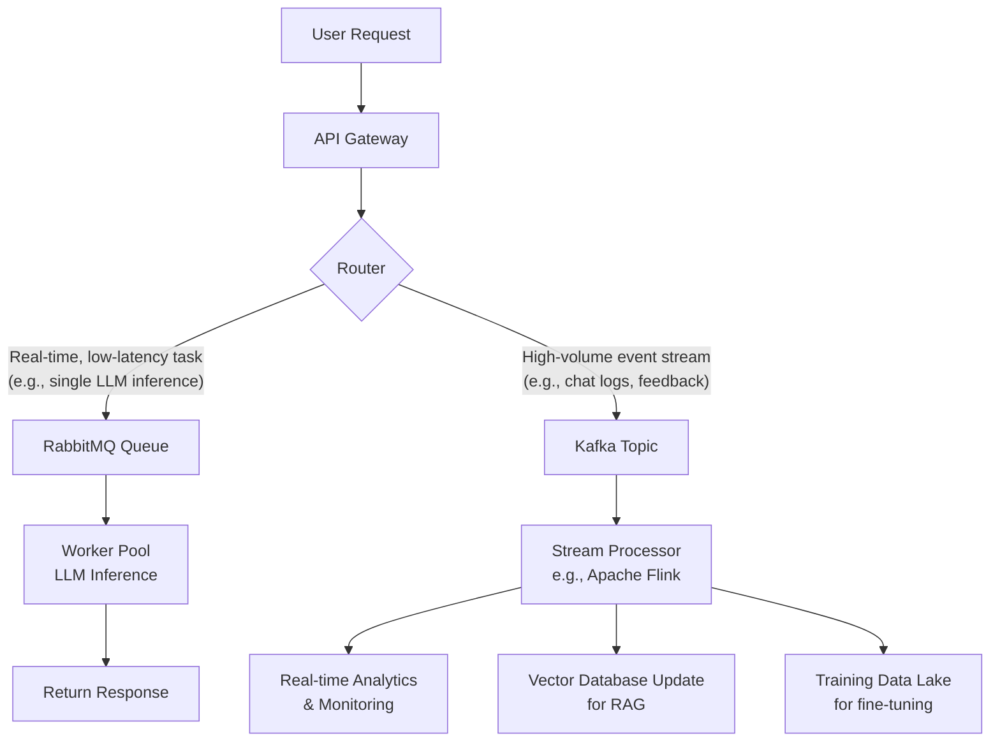

Yes, you can absolutely use both RabbitMQ and Apache Kafka in your API stack for LLM systems. They serve as the asynchronous communication backbone, enabling scalable, reliable, and real-time data flows that are critical for modern AI applications.

📊 How RabbitMQ & Kafka Fit in LLM API Engineering

While both are messaging systems, they excel in different scenarios. The table below summarizes their key characteristics and typical use cases in an LLM stack:

Aspect RabbitMQ (Message Broker) Apache Kafka (Event Streaming Platform)
Core Model Push-based, immediate delivery. Pull-based, sequential log.
Best For Low-latency, task-oriented messaging (e.g., request/response, job queues). High-throughput, event-driven pipelines (e.g., data ingestion, stream processing).
Typical LLM Use Case Queueing individual LLM inference requests, managing chat sessions, distributing batch prompts. Ingesting real-time user interactions, streaming log data for model fine-tuning, syncing vector databases.
Latency Sub-millisecond under moderate loads. Higher baseline (5-15 ms) but consistent under load.
Scalability Vertical scaling; clustering adds complexity. Horizontal scaling via partitions.
Data Persistence Optional; often in-memory for speed. Durable, replicated log as default.

🚀 Adoption Today

The adoption of these technologies in GenAI is growing rapidly, driven by the need for robust data infrastructure.

· Industry Trend: Leading architectures for Retrieval-Augmented Generation (RAG) and Agentic AI treat Apache Kafka as a central real-time data fabric. It orchestrates data flow between LLMs, vector databases, and applications. Event-driven architecture (EDA) powered by Kafka is considered essential for building scalable, reliable, and adaptive AI agents.
· Research Recognition: Academic surveys highlight that message brokers are "essential channels for data transfer" in GenAI systems, acknowledging the critical role of platforms like RabbitMQ and Kafka in meeting demands for high bandwidth, low latency, and robust data processing.
· Practical Guidance: The industry has moved beyond theoretical debate to practical guidance on choosing between them based on specific AI workload needs, such as latency versus throughput.

🏗️ How to Incorporate Them into Your System

You can integrate both tools to handle different parts of your LLM workflow effectively. The diagram below illustrates a potential architecture:

Implementation Steps:

1. Define Your Events & Messages: For Kafka, model key events (e.g., user_prompted, llm_response_logged). For RabbitMQ, define job messages (e.g., { "prompt": "...", "session_id": "..." }).
2. Set Up the Infrastructure: Deploy Kafka clusters for high-availability streaming and RabbitMQ clusters for managing job queues.
3. Develop Producers: Modify your API endpoints to publish events to Kafka topics and push asynchronous inference jobs to RabbitMQ queues.
4. Develop Consumers:
   · For RabbitMQ: Implement worker services that consume jobs, call the LLM API, and return results.
   · For Kafka: Implement stream processing jobs (e.g., using Apache Flink) to enrich events, update vector indexes in real-time, or aggregate data for monitoring.
5. Monitor and Scale: Monitor queue depths (RabbitMQ) and consumer lag (Kafka). Scale your RabbitMQ workers horizontally and add Kafka partitions as load increases.

🤔 Key Decision: Which One to Choose?

Your choice depends on the primary pattern of your data flow:

· Choose RabbitMQ if your main need is a high-performance task queue for managing LLM inference requests, especially where sub-millisecond latency is critical.
· Choose Apache Kafka if your system is event-centric, requiring replayable streams of data for multiple downstream consumers (RAG, training, analytics).
· Use both in a complementary pattern, as shown in the architecture above, to leverage the strengths of each.

If you can share more about your specific LLM use case (e.g., real-time chat, batch document processing, or agentic workflows), I can provide more tailored architectural advice.

Yes, you can—and should—use both RabbitMQ and Kafka in a modern LLM system. They are complementary technologies that solve different problems in the data pipeline. The industry trend is moving towards this hybrid approach, leveraging the strengths of each .

Their distinct roles can be summarized by a simple analogy: RabbitMQ is your real-time task dispatcher, while Kafka is your system's persistent event log and data highway.

Here’s how they differ and where each excels:

RabbitMQ: The Real-Time Coordinator

· Core Model: Traditional message broker using a push model for immediate delivery.
· Best For: Low-latency task queuing and orchestration. Think managing individual LLM inference requests, distributing batch jobs, or handling chatbot message delivery.
· Key LLM Fit: Ensures single, guaranteed execution of time-sensitive tasks. A request comes in, RabbitMQ routes it to an available worker, and the task is done.

Apache Kafka: The Event Streaming Backbone

· Core Model: Distributed streaming platform using a pull model, storing messages in an ordered log.
· Best For: High-throughput event streaming and data pipelines. Ideal for ingesting user interactions, streaming logs for model fine-tuning, or syncing data to vector databases.
· Key LLM Fit: Acts as a replayable "source of truth." Multiple services (analytics, monitoring, RAG updates) can independently process the same stream of events at their own pace.

🏗️ How They Fit into LLM API Engineering

You can architect your system to use each tool for its strengths. Here are two primary integration patterns:

Pattern 1: The Orchestrated Workflow (Most Common)
Use Kafka as the central nervous system for all events, and RabbitMQ for executing specific, high-priority tasks triggered by those events.

· How it works: A user query event streams into Kafka. A stream processor (e.g., Apache Flink) reads it, decides an LLM call is needed, and pushes a specific inference job to a RabbitMQ queue. A dedicated worker pool consumes from RabbitMQ, calls the LLM API, and posts the result back to another Kafka topic.
· Benefit: Kafka retains the full event history for replay or audit; RabbitMQ ensures the inference task is executed once, quickly, with built-in retries and failover.

Pattern 2: The Specialized Data Highway
Use Kafka exclusively for high-volume, data-centric flows and RabbitMQ for all application-level coordination.

· Kafka's Role: Powers the real-time data pipeline for Retrieval-Augmented Generation (RAG). Every document update, user query, and chat session is an event on Kafka, continuously updating your vector database and feeding real-time analytics.
· RabbitMQ's Role: Handles all operational control messages, like scaling worker instances, managing A/B testing traffic, or distributing user sessions across different LLM models.

📈 Adoption and Strategic Use Today

This hybrid pattern is recognized as a best practice. Leading companies like Uber and Airbnb use both in their architectures—Kafka for core data pipelines and real-time analytics, and RabbitMQ for reliable microservices communication and task queues.

The adoption is driven by the clear separation of concerns: RabbitMQ for "doing work now," Kafka for "remembering what happened." Trying to force one to do the other's job leads to complexity and poor performance.

🛠️ How to Incorporate Them: A Starter Guide

1. Map Your Data Flows: Identify what are discrete "tasks" (use RabbitMQ) vs. continuous "event streams" (use Kafka).
2. Start Simple:
   · Set up a Kafka topic (e.g., user-prompt-events) to log all inputs.
   · Set up a RabbitMQ queue (e.g., llm-inference-tasks) for actual model calls.
   · Write a small stream processor that listens to the Kafka topic and enqueues jobs into RabbitMQ.
3. Use Connectors: Both ecosystems offer tools (like Kafka Connect) to bridge data between them, letting you easily forward messages from RabbitMQ to Kafka for long-term storage, or vice versa.

⚠️ Key Considerations

· Don't Misuse Them: Avoid using Kafka as a simple task queue—its overhead is too high. Avoid using RabbitMQ for event streaming—you'll lose data history and replay capability.
· Monitor Both: Track RabbitMQ queue depth and consumer status. For Kafka, monitor consumer lag to ensure events are being processed timely.

To decide where to start, ask: "Do I need this data/event to be potentially processed by multiple systems now or in the future, and possibly replayed?" If yes, it's a candidate for Kafka. "Is this a specific job that must be executed reliably and exactly once by a single worker?" If yes, start with RabbitMQ.

If you can share more about a specific component you're designing (e.g., a real-time chat interface, a batch document processing pipeline, or a training data collection system), I can offer more targeted architectural advice.
