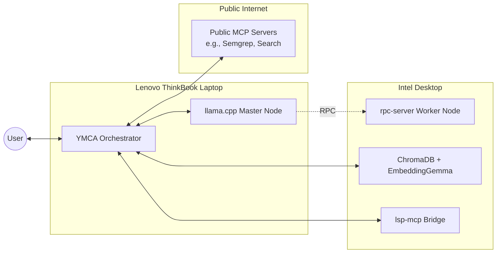

# Light Local LLM

Would it be possible to run locally using llama.cpp some very 'weak' LLM in terms of Bs but with strong other capabilites in terms of reasoning, and then to fill all the 'holes' by providing to it access to strong RAGs, MCPs, LSPs, ACPs, Embeddings and other tools? If yes how would we achieve such challenge?

This is not only possible, but it's the architectural blueprint for the next generation of efficient, private, and powerful local AI. A small, locally-run "reasoning engine" can be transformed into a highly capable agent by augmenting it with external tools and knowledge bases. The key is to shift the model's role from being a repository of facts to an orchestrator of specialized tools.

## 🧠 The Core Idea: Your LLM as an Orchestrator, Not an Encyclopedia

A small LLM's primary value lies in its reasoning, instruction-following, and tool-use capabilities. By following a specific architectural pattern, you can effectively outsource all other functions:

*   **RAG (Retrieval-Augmented Generation)** and **Embeddings** provide vast, up-to-date, private knowledge.
*   **MCP (Model Context Protocol)** servers act as the universal "toolbox," giving the agent standardized access to databases, APIs, file systems, web browsers, and more.
*   **LSP (Language Server Protocol)** servers provide deep, real-time code intelligence.
*   **ACP (Agent Communication Protocol)** allows multiple local agents to coordinate and collaborate on complex tasks.

### 🏗️ The Architectural Blueprint

This agentic system uses a straightforward orchestration layer to manage all interactions between the LLM and its tools:

```mermaid
flowchart LR
    User((User)) <--> Orchestrator

    subgraph Orchestrator [Orchestration Layer<br>FastAPI / agent.cpp / YMCA]
        Orchestrator
    end

    Orchestrator <--> LLM
    
    subgraph LLM [Local LLM Engine]
        direction LR
        llama_cpp[llama.cpp Server<br>with GGUF Model]
    end

    Orchestrator <--> Tools

    subgraph Tools [Tool Ecosystem]
        direction TB
        MCP_Servers[MCP Servers<br>Browser, Filesystem, API]
        LSP_Server[LSP Server<br>Code Intelligence]
        ACP[ACP Network<br>Other AI Agents]
    end

    Orchestrator <--> RAG

    subgraph RAG [RAG Pipeline]
        direction LR
        VectorDB[(Vector Database<br>Chroma, FAISS)]
        Embedding[Embedding Model<br>sentence-transformers]
    end
```

### 🛠️ Step-by-Step Implementation Guide

#### 1. The "Weak" Reasoning Engine (The Core)

The first step is choosing and running your core model via `llama.cpp`. The goal is to find a small model with strong reasoning, like the **Llama 3.2 3B**, **Qwen2.5 7B**, or **Granite 3.0 3B**[reference:0][reference:1][reference:2]. You would then run it with the `llama-server`, which is `llama.cpp`'s lightweight HTTP server. It now even includes built-in support for MCP, which simplifies the setup considerably[reference:3].

#### 2. The Orchestration Layer (The Conductor)

This layer is the "glue" that connects the LLM to all your tools. You have several excellent options:

*   **For a lightweight, custom Python solution:** Use a framework like **FastAPI** to create a simple agent loop that calls the LLM, decides which tools to use, and executes them[reference:4][reference:5].
*   **For a complete, ready-to-use framework:** **YMCA** (Yaacov's MCp Agent) is built specifically for this purpose. It uses `llama.cpp`, supports MCP servers, and includes semantic memory via ChromaDB, making it an ideal starting point[reference:6].
*   **For a low-level, high-performance C++ approach:** Mozilla's **`agent.cpp`** provides building blocks for creating local agents with tool use and multi-agent support, all built on `llama.cpp`[reference:7].

#### 3. RAG & Embeddings (The Long-Term Memory)

This gives your agent a private, updatable knowledge base:

*   **Load Documents:** Use a tool like `pypdf` to load your PDFs, text files, or markdown documents[reference:8].
*   **Chunk & Embed:** Split the loaded documents into smaller pieces and use an embedding model (e.g., `sentence-transformers/all-MiniLM-L6-v2`) to convert them into numerical vectors[reference:9].
*   **Store in a Vector DB:** Save these vectors in a local database like **Chroma** or **FAISS** to enable fast semantic search[reference:10][reference:11].
*   **Integrate with the Agent:** In your orchestration layer, before sending a user query to the LLM, first search the vector DB for relevant information and add that as context. This grounds the LLM's response in your specific data.

#### 4. MCP (The Universal Toolbox)

MCP standardizes how your LLM accesses tools. This is where your agent gets its "hands":

*   **Run MCP Servers:** You can run any of the hundreds of existing servers. For example, a **Filesystem MCP** server gives the agent access to your local files, a **Browser MCP** server (like the one using Playwright) lets it navigate and scrape the web, and a **Fetch MCP** server allows it to retrieve content from URLs[reference:12].
*   **Connect to the LLM:** Your orchestration layer must connect to these servers. The `llama.cpp` MCP bridge and `YMCA` are specifically designed for this[reference:13][reference:14].

#### 5. LSP (The Code Intelligence)

To supercharge your agent's coding abilities, you integrate an LSP server:

*   **Run an LSP Backend:** **`llm-ls`** is an excellent choice. It is an LSP server that can be configured to use your local `llama.cpp` backend, providing your agent with a way to get intelligent code completions and understand the structure of code files[reference:15].
*   **Integrate with the Orchestrator:** Your orchestration layer would then use LSP's capabilities. For instance, when you ask the agent to "fix the bug in the `calculate_total` function," the agent could query the LSP server to find that function's definition and its usages across the project before attempting a fix.

#### 6. ACP (The Collaboration Protocol)

For more complex tasks, you can create a multi-agent system:

*   **Set Up an ACP Network:** Use a framework like IBM's **BeeAI**, which is designed to be local-first and implements ACP[reference:16].
*   **Create Specialized Agents:** You could create one ACP agent for coding, another for web research, and a third for managing your calendar.
*   **Enable Collaboration:** Your main orchestrator could then delegate tasks. For example, a request to "plan a team meeting to discuss the project's API changes" might see the main agent asking the coding agent for a summary of API changes and the calendar agent for everyone's availability. These sub-agents would communicate using the ACP standard[reference:17].

### 💡 Practical Considerations

*   **Model Choice & Reasoning Ability:** The small model you choose must have strong instruction-following capabilities and support for function/tool calling. Models like **Qwen2.5** and **Granite** are known to perform well in this area[reference:18].
*   **Selective Context Loading:** To stay within the small model's context window, use "selective context loading." This means your orchestrator uses semantic search to find and load only the most relevant tools and information for a given query, rather than dumping everything into the prompt[reference:19].
*   **Managing Tool Reliability:** A key challenge is handling tool failures, timeouts, or partial results. Your orchestration layer needs robust logic for error handling and retries. Start with a "sandbox" MCP server to test tool schemas before deploying critical tools[reference:20].
*   **The Future: Native MCP in llama.cpp:** Keep an eye on `llama.cpp`'s development. Native MCP support has already been merged, which will make this entire architecture even simpler and more powerful out of the box[reference:21].

### 💎 Summary

You can indeed build a powerful, local AI system that combines a small, efficient reasoning model with external tools. This "orchestrator" pattern lets you create an agent that is knowledgeable, capable, and private, all running on your own hardware. Projects like **YMCA** and the native MCP support in `llama.cpp` are already making this future a reality.

If you have a specific use case in mind, like a local coding assistant or a private research analyst, I can help you narrow down the best tools and provide a more detailed guide for that path.

## The steps?

Create me now step by step guide how to achieve this with following hardware configuration: Intel i7 11th generation, 64gb ddr4 ram, nvme2 ssd storage 2 x 2tb + another host machine AMD Ryzen 9, 32 gb ddr4 ram, nvidi rtx graphics (this is Lenovo Thinkbook laptop 16 pro), 4 tb nve2 ssd storage. We can rely to all publicially accessible free MCP, LSP, RAG, Embeddings, ACP and other server instances which we could use instead of them running loclaly. We MUST run locally only the instance of these services if free open access does not exist anywhere. RAGs MUST give the knowledge of software development and architecture for cutting edge enterprise software quality - backend, frontend, web, desktop, mobile, cross platforms, etc.

### Step by step

This is an excellent architectural goal. Building a local, tool-augmented AI system using your powerful hardware and free public tools is not only possible but represents a cutting-edge approach. The key is to let your local "reasoning engine" focus on thinking and deciding, while outsourcing specific tasks to specialized tools.

Here is a step-by-step guide to achieving this, tailored to your hardware and your "enterprise software quality" requirement.

### 🧠 A Note on Your Hardware

Your setup is very capable. The ThinkBook with its RTX GPU is ideal for running the main LLM (the "brain"), as it offers fast inference[reference:0]. The second Intel machine, with its 64GB of RAM, is perfect for handling the heavier "knowledge base" (the RAG system). For this guide, we'll use the laptop as the primary "orchestrator" node, with the desktop as the dedicated "knowledge server."

### 🗺️ The Blueprint: How It All Fits Together

Your system will work by connecting a local "orchestrator" (running on your laptop) to a series of tools. The flowchart below maps out the entire architecture we'll be building:

```mermaid
flowchart LR
    subgraph Laptop [Lenovo ThinkBook Laptop (Primary Node)]
        Orchestrator[Orchestrator<br>Python / FastAPI]
        LLM[Local LLM Engine<br>llama.cpp]
        LSP[LSP Server<br>llm-ls / lsp-mcp]
    end

    subgraph Desktop [Intel Desktop (Knowledge Server)]
        RAG_KB[RAG Knowledge Base<br>Chroma / FAISS]
        Embeddings[Embeddings<br>EmbeddingGemma]
    end

    subgraph Public [Public Internet]
        MCP_Public[Public MCP Servers]
        ACP_Public[Public ACP Services]
    end

    User((User)) <--> Orchestrator
    Orchestrator <--> LLM
    Orchestrator <--> LSP
    Orchestrator <--> RAG_KB
    RAG_KB <--> Embeddings
    Orchestrator <--> MCP_Public
    Orchestrator <--> ACP_Public
```

This setup ensures your main agent (the orchestrator) can tap into a rich ecosystem of tools for code intelligence (LSP), domain-specific knowledge (RAG), and general-purpose actions (MCP/ACP).

### 📝 Step-by-Step Implementation Guide

#### Step 1: Choose & Run Your "Weak" Reasoning Model (The Brain)

Your first step is to pick a small but smart model and run it via `llama.cpp`. The goal is a model that excels at logic and tool use. The **Qwen2.5 7B Instruct** or the newer **Qwen3-4B-Instruct** are excellent choices[reference:1]. They are small, efficient, and known for strong reasoning. Here's how to set it up on your laptop:

*   **Install `llama.cpp`**: You can use a fully automated PowerShell script for Windows. It will install all prerequisites like Visual Studio Build Tools and the right CUDA version for your RTX GPU, then build `llama.cpp` for you[reference:2][reference:3].
    ```powershell
    # Run this in an elevated (Admin) PowerShell
    Set-ExecutionPolicy Bypass -Scope Process -Force
    ./install_llama_cpp.ps1
    ```
    This script will also give you a `run_llama_cpp_server.ps1` script that automatically downloads a recommended model (like Qwen3-4B) and starts the server for you[reference:4].

*   **Verify the Server**: Once running, `llama-server` will be available at `http://localhost:8080`. Your orchestrator will communicate with it here.

#### Step 2: Build Your Enterprise RAG System (The Long-Term Memory)

This is where you create a private, intelligent knowledge base for your "enterprise software quality" needs. You'll use the Intel desktop for this step, as it's best for data processing.

*   **Select an Embedding Model**: You need a model to convert your documentation into a searchable format. Google's **EmbeddingGemma** (308M parameters) is perfect. It's fast, runs on-device (keeping your data private), and can be quantized to use less than 200MB of RAM, making it ideal for your desktop[reference:5][reference:6].
*   **Choose a Vector Database**: This is where the "embeddings" of your documents are stored. **Chroma** is a great choice because it's lightweight, open-source, and integrates well with our other tools[reference:7].
*   **Assemble Your Knowledge Base**: Collect your documentation into a `docs` folder. This should include:
    *   **Software Architecture**: Clean Architecture, Domain-Driven Design (DDD), Microservices, Event-Driven Architecture.
    *   **Backend/Frontend**: Latest best practices for Spring Boot, React, .NET Core, Flutter, etc.
    *   **Quality**: Testing strategies (unit, integration, E2E), code review checklists, security guidelines.
    *   **Cross-platform**: Documentation for frameworks like Flutter, React Native, Kotlin Multiplatform.
*   **Create the RAG Pipeline**: Use a Python script to connect all the pieces. The core logic is:
    1.  Load all documents from your `docs` folder.
    2.  Split them into smaller chunks.
    3.  Generate embeddings for each chunk using your embedding model.
    4.  Store these chunks and their embeddings in Chroma.

    The open-source repository `langchain-rag-pipeline` provides an excellent template for this, using LangChain, Llama.cpp, and ChromaDB[reference:8][reference:9]. It includes a `.env` file for configuration, making it easy to adapt.

#### Step 3: Connect Your Orchestrator to a Tool Ecosystem (The Hands)

With the brain and memory ready, you now give your agent "hands" to interact with the world. The Model Context Protocol (MCP) is the standard way to do this.

*   **Connect to Free Public MCP Servers**: For many tasks, you can use existing free public servers, which saves you from hosting them yourself.
    *   **Find Servers**: Explore the **Metorial MCP Index**, a growing list of open-source MCP servers, or the `public-mcp-servers` GitHub repo for ready-to-use endpoints[reference:10][reference:11].
    *   **Examples of Public Servers**:
        *   `everything.mcp.inevitable.fyi`: A multi-purpose server with various capabilities[reference:12].
        *   `time.mcp.inevitable.fyi`: Provides time-related functionality[reference:13].
        *   `echo.mcp.inevitable.fyi`: Useful for debugging and testing[reference:14].

*   **Integrate LSP for Code Intelligence**: This gives your agent IDE-like superpowers. You can use **lsp-mcp**, which acts as a bridge between MCP and any Language Server (like `rust-analyzer` or `pyright`)[reference:15]. This allows your agent to ask for code completions, find definitions, and get diagnostics directly[reference:16].
    *   **Installation**: `git clone https://github.com/Tritlo/lsp-mcp` and follow the setup instructions for your preferred language servers.

*   **Set Up ACP for Multi-Agent Collaboration**: For truly complex tasks, you can break them down. The **Oxford-AI-Summit-2025-Local-Agents** repository is a production-grade example of a multi-agent system that runs 100% locally[reference:17]. You can adapt it to have one agent for research, another for code review, and a third for quality assurance, all coordinated by your main orchestrator[reference:18].

#### Step 4: Create the Orchestrator (The Conductor)

This is the central Python script that ties everything together. It's the "glue" that your LLM will talk to.

*   **The Core Loop**: The script will:
    1.  Take your question.
    2.  Search the RAG database for relevant information.
    3.  Formulate a prompt with that information and send it to the `llama.cpp` server.
    4.  Parse the LLM's response. If the LLM decides it needs to use a tool (like "search the web" or "get code completion"), the orchestrator will make the appropriate MCP/LSP call.
    5.  Take the tool's result, add it to the conversation context, and ask the LLM for its final answer.
*   **Use a Framework**: You can build this from scratch with **FastAPI**, or use a higher-level framework like **LangChain** or **LlamaIndex**, which have built-in support for tool use and agents. The `langchain-rag-pipeline` repository mentioned earlier is a great starting point[reference:19][reference:20].

#### Step 5: Put It All Together & Optimize

Now, connect all the components by configuring your orchestrator to point to the correct endpoints for your RAG database, MCP servers, and LSP bridges.

*   **Test the System**: Ask it a complex, multi-step question that requires knowledge, reasoning, and a tool, e.g., "Based on our microservices architecture docs, find the definition of the `UserService` in our codebase and suggest improvements for its API error handling."
*   **Optimize**:
    *   **Performance**: On your laptop, ensure `llama.cpp` is using your RTX GPU (set `-ngl 9999` or similar in the server script).
    *   **Latency**: Keep prompts concise to avoid overwhelming the small model's context window. Only feed it the most relevant information from RAG.

---

This approach gives you a private, powerful, and extensible local AI system. You can start simple and gradually add more specialized tools, creating an agent that grows in capability alongside your projects.

If you'd like, I can dive deeper into any of these specific steps, such as the exact code for a simple orchestrator or a more detailed RAG configuration for your enterprise documents.

## Can we rely to RCP support?

What if we use llama.cpp with RCP and both laptop machines for running the LLM?

Also, provide everything you suggested too!

### Here is what if RCP + more

Absolutely. Combining both of your machines into a single, powerful "virtual GPU" with RPC is an excellent way to take your local AI system to the next level. Your hardware is very well-suited for this, and the RPC feature in `llama.cpp` is designed precisely for scenarios like yours.

This guide expands on our previous plan, integrating the RPC-based cluster to run significantly larger models with enterprise-grade reasoning. I'll also include the complete MCP/RAG/LSP/ACP ecosystem from our earlier discussion.

### 🏗️ Why Use RPC with Your Hardware?

The primary reason to use RPC is to overcome the memory limitations of a single machine[reference:0]. Your ThinkBook laptop has a powerful RTX GPU, but its VRAM may be limited (typical laptop GPUs have 8-16GB). Your desktop, while having more system RAM (64GB), may have a weaker GPU or rely on CPU inference. By combining them with RPC, you can pool their resources. The model is split up and each machine handles a portion of the computation[reference:1].

This "memory pooling" gives you several key advantages:
*   **Run Larger Models**: You can run models like a 70B parameter Llama-3.1 (quantized to ~38GB)[reference:2], or even larger reasoning models like a 1 trillion-parameter Kimi K2.5 if you had more nodes[reference:3], which neither of your machines could handle alone.
*   **Combine Different Hardware**: RPC is heterogeneous[reference:4]. The laptop's RTX GPU can handle the compute-heavy layers, while the desktop's ample system RAM can load a large chunk of the model's weights.
*   **Distribute Memory Overhead**: The Key-Value (KV) cache for long contexts is a major memory consumer. RPC can distribute this cache across both machines[reference:5].
*   **Single Logical Accelerator**: Your two separate machines will function as one logical AI accelerator, making them easier to manage and interact with from the orchestrator[reference:6].

> **⚡️ Performance Note**: Distributed inference introduces network latency. The main benefit is enabling models that otherwise wouldn't run. While your 1GbE network is fine for testing, consider a high-speed switch and Cat5e/Cat6 cabling to minimize overhead for optimal performance[reference:7][reference:8].

### 🗺️ The Architecture: Laptop as Master, Desktop as Worker

```mermaid
flowchart LR
    subgraph Laptop [Lenovo ThinkBook Laptop (Master Node)]
        Orchestrator[Orchestrator<br>Python / FastAPI]
        Master_LLM[Master llama.cpp Process<br>with --rpc flag]
        LSP[LSP Server]
    end

    subgraph Desktop [Intel Desktop (Worker Node)]
        RPC_Server[rpc-server process<br>listening for tasks]
    end

    subgraph Public [Public Internet / Other Services]
        MCP_Public[Public MCP Servers]
        ACP_Public[ACP Services]
        RAG_KB[RAG Knowledge Base]
    end

    User((User)) <--> Orchestrator
    Orchestrator <--> Master_LLM
    Master_LLM -.->|RPC over TCP| RPC_Server
    Orchestrator <--> LSP
    Orchestrator <--> MCP_Public
    Orchestrator <--> ACP_Public
    Orchestrator <--> RAG_KB
```

This architecture shows how the master node (your laptop) orchestrates the LLM, which in turn distributes its workload to the worker node (your desktop) via RPC.

### 🛠️ Step-by-Step Implementation Guide: The RPC Cluster

The following steps will turn your two machines into a unified AI cluster.

#### 1. Environment Preparation (Both Machines)

Before you start, complete these steps on both your laptop and desktop.

*   **Network Setup**:
    *   Connect both machines to the **same local network** (wired Ethernet is strongly preferred over Wi-Fi to reduce latency)[reference:9].
    *   **Assign static IP addresses** to both machines from your router's DHCP settings or within the OS. Note down their IPs (e.g., Laptop: `192.168.1.100`, Desktop: `192.168.1.200`). This ensures your configuration doesn't break after a restart[reference:10].
*   **Windows Firewall**:
    *   When you first run the RPC server, Windows Defender will prompt you. **Allow access** and ensure you select **"Private networks"** to permit local network communication[reference:11].
    *   As a fallback, manually create an "Inbound Rule" in "Windows Defender Firewall with Advanced Security" to allow TCP traffic on port `50052` (the default RPC port).
*   **Operating Systems**: This guide works for both Windows and Linux. For Windows, use **PowerShell** for the commands.

#### 2. Build/Run llama.cpp with RPC Support (Both Machines)

The most convenient way to get started is by downloading pre-built binaries for Windows.

*   Go to the [llama.cpp Releases page on GitHub](https://github.com/ggerganov/llama.cpp/releases)[reference:12].
*   Download the latest `llama-bXXXX-bin-win-cuda-cu12.2.0-x64.zip` (or your specific CUDA version).
*   **On both machines**, extract the ZIP to a permanent folder (e.g., `C:\llama`).

#### 3. Launch the RPC Worker (Desktop)

The Intel desktop will act as the dedicated "worker" that provides its RAM and CPU/GPU for the model.

*   Open a PowerShell window in your `C:\llama` folder.
*   To start the RPC server, use the following command:
    ```powershell
    .\rpc-server.exe -p 50052 -H 0.0.0.0 -c
    ```
    This will launch the RPC server on the default port `50052`[reference:13], listening for connections from your laptop (`0.0.0.0` means all available network interfaces)[reference:14]. The `-c` flag enables local file caching, which significantly speeds up subsequent model loads by avoiding re-transfers over the network[reference:15].

#### 4. Run the RPC-Enabled LLM (Laptop)

Now, on your ThinkBook laptop, you will run the main `llama-server` and connect it to the worker.

*   Open a PowerShell window in your `C:\llama` folder.
*   Download the GGUF model of your choice (see the "Choosing a Model" section below).
*   Run the server, connecting it to your desktop's RPC instance:
    ```powershell
    .\llama-server.exe -m "C:\path\to\your\model.Q4_K_M.gguf" -c 4096 -ngl 99 --rpc 192.168.1.200:50052
    ```
    Let's break down the key arguments:
    *   `-m`: Specifies the path to your model file.
    *   `-c`: Sets the context size (e.g., 4096, 8192).
    *   `-ngl 99`: Offloads 99 layers to the GPU. This is where the magic happens: `llama.cpp` will now **automatically distribute the model's layers** across your local GPU and the remote RPC server based on their available memory[reference:16].
    *   `--rpc`: This is the crucial flag. Provide the IP address and port of your **desktop's RPC server** (e.g., `192.168.1.200:50052`). You can specify multiple workers by separating them with commas: `--rpc 192.168.1.200:50052,192.168.1.201:50052`.

##### 🧠 Choosing a Model for the RPC Setup

With your pooled resources, you can comfortably run much larger models. Here are some excellent recommendations that will work well for your goal of enterprise software quality.

| Model | Size (Quantized) | Why It's a Great Choice | Why Your RPC Setup Excels |
| :--- | :--- | :--- | :--- |
| **Qwen2.5-14B-Instruct** | ~9GB (Q4_K_M) | Top-tier model for coding, math, and reasoning. A major step up from 7B models. | Single machine can handle it, but RPC lets you split the load, leaving more room for a large KV cache. |
| **Llama-3.1-70B-Instruct** | ~38GB (Q4_K_M) | Meta's flagship model. Excellent general knowledge, coding, and complex reasoning. | **This is the sweet spot.** Your laptop's GPU (~8-16GB) + desktop's RAM (64GB) can easily host this model. |
| **Mixtral-8x22B-Instruct** | ~67GB (Q4_K_M) | A massive Mixture-of-Experts model, incredibly knowledgeable and strong at following complex instructions. | This model would be impossible to run on either machine alone. Your RPC cluster is the *only* way to run it. |
| **DeepSeek-V2-Lite-Chat** | ~30GB (Q4_K_M) | A powerful MoE architecture designed for high performance. | Excellent distribution: your laptop's GPU can handle a few active experts while the rest reside in your desktop's RAM. |

> **💡 Important**: For optimal distribution across your heterogeneous hardware, the `--tensor-split` argument can be used to manually specify how tensors are divided. However, `llama.cpp`'s automatic distribution is often sufficient. Use `--tensor-split` only if you see suboptimal performance or memory allocation.

### 🔗 Integrating the Full Tool Ecosystem

Once your RPC cluster is running, you can integrate all the tools from our previous discussion. Your orchestrator (e.g., a Python script using `requests` to call `http://localhost:8080`) remains unchanged. The complexity of distributed inference is completely hidden behind `llama.cpp`'s standard API.

1.  **RAG for Enterprise Knowledge**: Use `llama.cpp`'s RPC feature to also distribute your embedding models for RAG[reference:17]. You can run `rpc-server` on the desktop to handle embeddings and another on the laptop for the LLM itself, creating a highly efficient pipeline.
2.  **MCP for Tool Access**: Your orchestrator can still use public MCP servers for web search, fetching documentation, or interacting with APIs.
3.  **LSP for Code Intelligence**: Connect your orchestrator to an LSP server like `llm-ls` to give your agent deep code understanding capabilities.
4.  **ACP for Multi-Agent Collaboration**: Use the ACP protocol to allow your main agent to delegate sub-tasks to other specialized agents, all running on your RPC cluster.

### 🔐 Security and Performance

*   **Security Warning**: The RPC server is **not secure by default** and should **never be exposed to the open internet**[reference:18][reference:19]. Use it only within your trusted local network.
*   **Performance Bottlenecks**: Your network will likely be the primary bottleneck. If you find performance unsatisfactory, try the following optimizations:
    *   **Enable `-c` caching**: As mentioned, this is crucial.
    *   **Tweak batch size**: Experiment with `-ub 1024` or higher to improve throughput.
    *   **Monitor the worker**: Watch the PowerShell window on your desktop for logs and to ensure it's receiving tasks.

### 💎 Summary: RPC vs. Standard Setup

Here is a quick comparison to help you decide which approach is best for your needs.

| Feature | Standard Setup (No RPC) | RPC Distributed Setup |
| :--- | :--- | :--- |
| **Model Size** | Limited by single machine's RAM/VRAM | Pooled memory of all machines (theoretical max ~80GB+) |
| **Hardware Utilization** | Each machine runs separate tasks | Machines combine to run a single, much larger model |
| **Primary Use Case** | Running multiple smaller models (7B-13B) for different tasks | Running one very large model (30B-70B+) with enterprise-grade reasoning |
| **Complexity** | Simple to set up and maintain | More complex, requires network configuration and monitoring |
| **Latency** | No network overhead | Some network latency, depends on speed and quality |

Your final system will be a highly capable, private, and powerful local AI that can tackle the most demanding software engineering tasks. Start with the RPC cluster to get the "brain" working, and then gradually integrate the RAG, MCP, LSP, and ACP tools to build a complete agentic system.

If you'd like a deeper dive into any of these steps, such as a sample orchestrator script or a specific RAG configuration for enterprise documents, feel free to ask.

## The full development guide

I will guide you through building a complete, production-ready local AI system that fuses the reasoning of a distributed LLM with a full ecosystem of specialized tools. This guide is designed to be a comprehensive reference, so feel free to jump between sections as you build out each component.

### 💡 A Note on Your Hardware

Your setup is excellent for this project. The laptop's RTX GPU is perfect for running the core LLM, while the Intel desktop's 64GB of RAM is ideal for hosting a large vector database and other memory-heavy services.

*   **🖥️ Lenovo ThinkBook (Primary Node)**: `llama.cpp` master node and main orchestrator.
*   **💻 Intel Desktop (Worker Node)**: `llama.cpp` worker node, RAG database (ChromaDB), MCP servers, and LSP servers.

### 🧠 Step 1: Setting Up the Distributed LLM with llama.cpp RPC

The first step is to pool your hardware's memory using llama.cpp's RPC feature, allowing you to run models far larger than either machine could handle alone[reference:0].

#### 1.1 Prepare Both Machines

1.  **Network Setup**: Connect both machines to the same wired network and assign static IP addresses (e.g., Laptop: `192.168.1.100`, Desktop: `192.168.1.200`) to ensure stable communication.
2.  **Windows Firewall**: On both machines, create a new inbound rule in "Windows Defender Firewall with Advanced Security" to allow TCP traffic on port `50052`.

#### 1.2 Install `llama.cpp` and Build with RPC

For the easiest experience, we'll use pre-built binaries. **On both machines**, download the latest `llama-bXXXX-bin-win-cuda-cu12.2.0-x64.zip` from the [llama.cpp Releases page](https://github.com/ggerganov/llama.cpp/releases) and extract it to a folder like `C:\llama`.

#### 1.3 Launch the RPC Worker (Desktop)

This machine will act as the dedicated "worker" node. Open a PowerShell window in `C:\llama` and run the RPC server:

```powershell
.\rpc-server.exe -p 50052 -H 0.0.0.0 -c
```

*   `-p 50052` : Uses the default RPC port.
*   `-H 0.0.0.0` : Listens for connections from any device on the network.
*   `-c` : Enables caching for faster model loading.

#### 1.4 Launch the RPC Master (Laptop)

Now, on your laptop, run the main `llama-server` and connect it to the worker.

```powershell
.\llama-server.exe -m "C:\path\to\your\model.Q4_K_M.gguf" -c 8192 -ngl 99 --rpc 192.168.1.200:50052
```

*   `-m` : Path to your model file (e.g., a 70B parameter model).
*   `-c 8192` : Sets a generous context window.
*   `-ngl 99` : Offloads as many layers as possible to the laptop's GPU.
*   `--rpc` : The magic flag. This connects the master to the worker node. You can list multiple workers separated by commas.

With this setup, your two machines will function as one logical AI accelerator.

### 📚 Step 2: Building Your Enterprise RAG System

Your RAG system will provide the LLM with private, up-to-date knowledge of software architecture and best practices.

#### 2.1 Choose an Embedding Model

For this, we will use Google's **EmbeddingGemma**, a 308 million parameter model designed for on-device performance[reference:1][reference:2].

*   **Performance**: It's small enough to run on less than 200MB of RAM with quantization, yet powerful enough to be the highest-ranking embedding model under 500M parameters on the MTEB leaderboard[reference:3].

#### 2.2 Install Dependencies

On your **desktop**, install the necessary Python packages:

```bash
pip install llama-cpp-python langchain langchain-community sentence-transformers chromadb pypdf tqdm python-dotenv
```

#### 2.3 Assemble Your Knowledge Base

Create a folder called `docs` and populate it with your enterprise software development resources. This should include:

*   **Architectural Patterns**: Clean Architecture, DDD, Microservices, Event-Driven Architecture, CQRS.
*   **Best Practices**: For backend (Spring Boot, .NET Core), frontend (React, Angular), web, desktop, mobile (Flutter, React Native), and cross-platform development.
*   **Quality Standards**: Testing strategies (unit, integration, E2E), code review checklists, and security guidelines[reference:4][reference:5].

#### 2.4 Implement the RAG Pipeline

The `langchain-rag-pipeline` repository by `ctschacher` provides an excellent template for this[reference:6][reference:7]. You can adapt its `rag.py` script. Below is a condensed version that ties all the pieces together.

```python
# rag_pipeline.py
import os
from dotenv import load_dotenv
from langchain_community.document_loaders import PyPDFLoader, TextLoader
from langchain.text_splitter import RecursiveCharacterTextSplitter
from langchain_huggingface import HuggingFaceEmbeddings
from langchain_community.vectorstores import Chroma
from langchain_community.llms import LlamaCpp
from langchain.chains import RetrievalQA
from langchain.prompts import PromptTemplate

# --- Configuration ---
DOCS_DIR = "./docs"
PERSIST_DIR = "./chroma_db"  # Where the vector DB will be stored
EMBEDDING_MODEL_NAME = "google/embeddinggemma-300m"  # Our chosen embedding model
MODEL_PATH = "C:/path/to/your/model.Q4_K_M.gguf"  # Path to your main LLM

# --- 1. Load and Split Documents ---
def load_documents(doc_dir):
    documents = []
    for file in os.listdir(doc_dir):
        if file.endswith(".pdf"):
            loader = PyPDFLoader(os.path.join(doc_dir, file))
            documents.extend(loader.load())
        elif file.endswith(".txt"):
            loader = TextLoader(os.path.join(doc_dir, file))
            documents.extend(loader.load())
    text_splitter = RecursiveCharacterTextSplitter(chunk_size=1000, chunk_overlap=200)
    return text_splitter.split_documents(documents)

# --- 2. Create or Load the Vector Store ---
def get_vectorstore():
    embeddings = HuggingFaceEmbeddings(model_name=EMBEDDING_MODEL_NAME)
    if os.path.exists(PERSIST_DIR) and os.listdir(PERSIST_DIR):
        # Load existing vector store
        return Chroma(persist_directory=PERSIST_DIR, embedding_function=embeddings)
    else:
        # Create new vector store from documents
        docs = load_documents(DOCS_DIR)
        vectorstore = Chroma.from_documents(docs, embeddings, persist_directory=PERSIST_DIR)
        vectorstore.persist()
        return vectorstore

# --- 3. Set up the LLM (Connecting to our RPC cluster) ---
llm = LlamaCpp(
    model_path=MODEL_PATH,
    temperature=0.1,
    max_tokens=2048,
    n_ctx=8192,  # Match the context size from your llama-server
    verbose=True,
)

# --- 4. Create the RAG Chain ---
retriever = get_vectorstore().as_retriever(search_kwargs={"k": 4})
prompt_template = """Use the following pieces of context to answer the question at the end.
If you don't know the answer, just say that you don't know, don't try to make up an answer.

Context:
{context}

Question: {question}
Answer:"""
PROMPT = PromptTemplate(template=prompt_template, input_variables=["context", "question"])

qa_chain = RetrievalQA.from_chain_type(
    llm=llm,
    chain_type="stuff",
    retriever=retriever,
    chain_type_kwargs={"prompt": PROMPT},
    return_source_documents=True,
)

# --- 5. Interactive Loop ---
while True:
    query = input("\nAsk a question about your enterprise software docs (or 'exit' to quit): ")
    if query.lower() == "exit":
        break
    result = qa_chain.invoke({"query": query})
    print("\nAnswer:", result["result"])
```

This script handles document loading, creating the vector store, and running the RAG chain, all while using your RPC-powered LLM.

### 🛠️ Step 3: Integrating MCP Servers for Tool Access

The Model Context Protocol (MCP) gives your LLM the ability to use tools, like a search engine, a filesystem, or a static analyzer[reference:8].

#### 3.1 Using Public MCP Servers

A great place to start is with free, publicly accessible servers to avoid running everything locally.

*   **IBM's ContextForge** provides a list of open MCP servers. A notable example is the **Semgrep MCP Server** (`https://mcp.semgrep.ai/sse`), which allows your agent to perform static code analysis and security scanning[reference:9].
*   The **cloud-ru/mcp-servers** collection offers servers for web search (DuckDuckGo), Wikipedia, and fetching URLs, all free without API keys[reference:10].

To use a public MCP server, your orchestrator (built in Step 5) will connect to it via its SSE or HTTP endpoint.

#### 3.2 Setting Up Local LSP-MCP (For Code Intelligence)

For deep code analysis, you need an LSP-MCP bridge. The `ts-lsp-mcp` project is a great example, providing TypeScript analysis tools through MCP[reference:11].

1.  **Installation**: Run the one-line install script:
    ```bash
    curl -fsSL https://raw.githubusercontent.com/CryogenicPlanet/ts-lsp-mcp/master/scripts/install.sh | bash
    ```
2.  **Configuration**: The server is then configured in your orchestrator's client settings. For Claude Desktop, you would add a block like this to `claude_desktop_config.json`[reference:12]:

    ```json
    {
      "mcpServers": {
        "ts-lsp-mcp": {
          "command": "ts-lsp-mcp",
          "args": ["--workspace", "/path/to/your/project"]
        }
      }
    }
    ```

Your orchestrator can then use this server to get hover info, definitions, references, and diagnostics for your code.

### 🧑‍💻 Step 4: Setting Up the Orchestrator

The orchestrator is the conductor that connects your LLM to all the tools. A powerful and simple framework for this is **YMCA (Yaacov's MCp Agent)**.

*   **What it is**: A local-first AI agent framework that uses `llama.cpp` and has built-in memory capabilities using vector embeddings[reference:13].
*   **Why it's a good choice**: It is specifically designed to run small, quantized models and connect them to MCP servers, aligning perfectly with our architecture.

While the specific setup steps will vary, the general approach is to:

1.  **Clone and Install YMCA**: `git clone https://github.com/yaacov/ymca.git` and follow its build instructions.
2.  **Configure YMCA**: Point it to your `llama-server` endpoint (`http://localhost:8080`) and to your local MCP servers.
3.  **Run the Agent**: YMCA will then handle the agentic loop, calling your LLM, determining which MCP tool to use, and returning the final result.

### 🔗 Step 5: Bringing It All Together

With all components in place, your final system architecture will look like this:



To test the full system, you can ask a complex, multi-step question like:

> "Based on our microservices architecture docs, find the definition of the `UserService` in our codebase using the LSP server, then analyze it for security vulnerabilities with the Semgrep MCP server and suggest improvements."

### 💎 Conclusion

By following this guide, you will have built a powerful, private, and extensible local AI system. The key is the "orchestrator" pattern, where a small, reasoning-focused LLM uses tools like RAG, MCP, and LSP to perform tasks far beyond its size.

If you run into any issues or have questions about a specific step, please let me know.

## Is it worth it?

How much would this solution(s) be capable to replace everyday use of Claude LLMs which are quite expensive? Does it make sens for professional use to go this path(s)?

The short answer is **yes, for many professional tasks, a well-architected local solution can not only replace Claude but offer tangible benefits like full data privacy and predictable, zero API costs.** However, it's not a perfect one-to-one replacement. The real decision is about where you place your bets: on the cutting-edge, out-of-the-box power of a cloud model, or on the control, privacy, and long-term cost-efficiency of a self-hosted system.

I'll break down the trade-offs so you can decide which path makes sense for your professional work.

---

### 💰 The Economic Case: Why Going Local Can Be a No-Brainer

From a purely financial standpoint, the case for a local solution is incredibly strong.

*   **Eliminating Recurring Costs**: A professional developer using Claude Code could easily spend over **$100 per month**[reference:0]. By setting up a local system, you replace those recurring API and subscription fees with a one-time capital expense for hardware, after which using the models is free[reference:1].
*   **Staggering Cost Per Token**: The price difference is stark. For input processing, Claude 3.5 Sonnet can be **15 times more expensive** than running Llama 3.1 70B on your own hardware ($3.00 vs. $0.20 per million tokens)[reference:2]. For high-volume tasks, this difference quickly adds up.
*   **A Real-World Case Study**: One developer documented distilling a 70B Llama model into an 8B fine-tuned version paired with RAG. This approach **cut costs by 70%** while keeping performance nearly identical to the much larger model[reference:3].

### ⚔️ The Capability Showdown: Local vs. Cloud

Performance is where the decision gets nuanced. Let's be direct: for raw, general-purpose reasoning power, Claude is still a heavy-weight champion[reference:4].

*   **Coding**: Qwen2.5 excels, but Claude 3.5 Sonnet achieves 75.6% on the HumanEval benchmark compared to Qwen2.5's 65.8%[reference:5]. However, newer Moonshot AI's Kimi-K2-Thinking scores 83.1% on LiveCodeBench V6, outperforming many cloud models in coding-specific tasks[reference:6].
*   **General Understanding**: On the MMLU benchmark, Claude 3.5 scores 82.1% vs. Qwen2.5's 76.2%[reference:7].

#### 📊 Performance Benchmarks at a Glance

| **Model** | **General Understanding (MMLU)** | **Coding (HumanEval)** | **Cost/M Tokens (Input)** |
| :--- | :--- | :--- | :--- |
| **Claude 3.5 Sonnet (Cloud)** | **82.1%** | **75.6%** | $3.00[reference:8] |
| **Llama 3.1 70B (Local)** | 78.9% | 72.1% | $0.20[reference:9] |
| **Qwen2.5-Coder (Local)** | 76.2% | 65.8% | $0.00 (post-hardware) |

> Benchmark scores for context; your results will vary based on the specific model and task[reference:10].

### 🤔 Navigating the Challenges: It's Not Just Plug-and-Play

Despite the huge cost savings, the local path comes with real-world challenges:

*   **Hidden "Taxes"**: Your initial hardware investment is just the first step. You'll also need to account for ongoing maintenance, updates, and the time you'll spend troubleshooting[reference:11].
*   **The Quality Gap**: While open-source models are rapidly catching up, cloud models like Claude are still widely considered superior for the most complex reasoning, creative tasks, and nuanced code generation[reference:12]. The difference in quality is noticeable for the most challenging problems.
*   **Context Window Constraints**: Running a massive context window locally is expensive. While you *can* do it, it will consume significant memory and slow down performance, whereas cloud services handle this seamlessly[reference:13].

### 🧠 A Professional's Hybrid Strategy: The Best of Both Worlds

You don't have to choose just one. The most pragmatic and professional approach is a **hybrid strategy**:

> **"For everyday tasks, I use local LLMs. For the hardest problems, I fire up Claude."**

This tiered approach is both effective and efficient:

*   **Level 1: The Workhorse (Local)**
    Use your local setup for routine tasks like:
    *   **Code completion and generation**: Tools like **Tabby** or **Continue.dev** provide instant, private autocomplete[reference:14][reference:15].
    *   **Refactoring and debugging**: Use models like **Qwen2.5-Coder** to quickly refactor code blocks or explain complex logic.
    *   **Documentation and unit tests**: Generate docstrings, READMEs, and unit tests without leaving your IDE.
    *   **Project-specific Q&A**: Your RAG system excels here. Ask specific questions about your proprietary codebase, and get answers grounded in your actual documentation, not generic internet data.

*   **Level 2: The Specialist (Cloud)**
    Keep a Claude subscription for the tasks where it truly shines:
    *   **Greenfield development**: "Build me a full-stack app from scratch with these 20 requirements."
    *   **Complex architectural design**: "Design a microservices architecture for a high-frequency trading platform."
    *   **Creative problem-solving**: Brainstorming innovative solutions or reframing complex business logic.
    *   **Learning new paradigms**: Asking "How do I implement this novel algorithm I just read about in a research paper?"

### 💎 The Verdict: Does It Make Sense for Professional Use?

Yes, absolutely. But the answer depends on your specific role:

*   **For the individual developer**: It's an **excellent investment**. The one-time cost of your hardware will pay for itself in months, and you'll gain a powerful, private, and customizable AI assistant. You get **zero recurring costs** and **complete data privacy**, with performance that will satisfy 80-90% of your daily needs[reference:16][reference:17][reference:18].
*   **For an enterprise or team**: It makes **even more sense**. Data security and privacy are paramount. Sending proprietary code to a third party is a non-starter for many companies. A self-hosted solution ensures **sensitive code never leaves your environment**[reference:19]. The ability to **customize and fine-tune** models on your own data creates a significant competitive advantage[reference:20]. While the upfront investment is larger, it's a strategic move that offers control and security that cloud subscriptions cannot match.

**Your path forward**: The architecture you've outlined is not just an experiment; it's a professional-grade blueprint for a more independent, secure, and cost-effective AI practice. I'd recommend starting with the local setup for your daily tasks, and you'll quickly see where it excels and where you might still want a cloud model as a backup. That hands-on experience is the best way to make the final call for your work.
