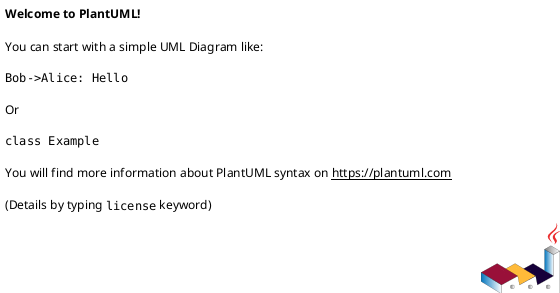

# SP5: Documentation Completeness — Implementation Plan

> **For agentic workers:** REQUIRED SUB-SKILL: Use superpowers:subagent-driven-development (recommended) or superpowers:executing-plans to implement this plan task-by-task. Steps use checkbox (`- [ ]`) syntax for tracking.

**Goal:** Zero broken links, every module documented, all diagrams rendered, SQL indexed, governance docs synchronized, user manuals and video courses cover all modules.

**Architecture:** Fix 32 broken links, add 6 modules to MODULES.md, render 2 missing PlantUML diagrams, create SQL schema index, consolidate duplicate docs, produce 7 new user manuals and 6 new video courses, synchronize CLAUDE.md/AGENTS.md/CONSTITUTION.md.

**Tech Stack:** Markdown, PlantUML, Mermaid, bash (link checker)

**Spec:** `docs/superpowers/specs/2026-03-25-comprehensive-completion-design.md` (SP5 section)

**Depends on:** SP1, SP2, SP3, SP4 (documents final state after all code changes)

---

### Task 1: Fix Broken Links in docs/deployment/

**Files:**
- Create: `docs/deployment/api-documentation.md`
- Create: `docs/deployment/configuration.md`
- Create: `docs/deployment/troubleshooting.md`
- Modify: `docs/deployment/kubernetes-deployment.md` (fix OPERATIONAL_GUIDE.md link)
- Modify: `docs/deployment/REMOTE_DEPLOYMENT.md` (fix SERVICE_MANAGEMENT.md link)

- [ ] **Step 1: Create docs/deployment/api-documentation.md**

Write deployment-specific API documentation covering: base URL configuration, endpoint availability per deployment mode, health check endpoints for load balancers.

- [ ] **Step 2: Create docs/deployment/configuration.md**

Write deployment configuration guide covering: environment variables, config file locations (`configs/development.yaml`, `configs/production.yaml`), container env injection.

- [ ] **Step 3: Create docs/deployment/troubleshooting.md**

Write troubleshooting guide covering: common boot failures, port conflicts, container networking, provider connectivity issues.

- [ ] **Step 4: Fix relative links in kubernetes-deployment.md and REMOTE_DEPLOYMENT.md**

Update broken references to point to correct files.

- [ ] **Step 5: Verify all links in docs/deployment/**

```bash
grep -rn '\[.*\](.*\.md)' docs/deployment/ | while read line; do
    file=$(echo "$line" | sed 's/.*(\(.*\.md\)).*/\1/')
    # Check if referenced file exists
done
```

- [ ] **Step 6: Commit**

```bash
git add docs/deployment/
git commit -m "docs(deployment): fix 5 broken links, create missing api-documentation, configuration, troubleshooting guides"
```

---

### Task 2: Fix Broken Links in docs/api/, docs/guides/, docs/sdk/, docs/monitoring/

**Files:**
- Fix: `docs/api/` (4 broken links)
- Create: `docs/guides/messaging-architecture.md`
- Create: `docs/guides/rabbitmq-integration.md`
- Create: `docs/guides/kafka-integration.md`
- Create: `docs/guides/performance-tuning.md`
- Create: `docs/security/AUTHENTICATION.md`
- Create: `docs/operations/RATE_LIMITING.md`
- Create: `docs/observability/OPENTELEMETRY.md`
- Fix: `docs/user/QUICKSTART.md` (1 broken link)
- Fix: `docs/development/README.md` (1 broken link)

- [ ] **Step 1: Fix docs/api/ links**

Fix relative paths and anchor references in `API_REFERENCE.md` and `api-reference-examples.md`.

- [ ] **Step 2: Create messaging sub-docs in docs/guides/**

Write `messaging-architecture.md`, `rabbitmq-integration.md`, `kafka-integration.md`, `performance-tuning.md` with content from the Messaging module docs and existing messaging guide.

- [ ] **Step 3: Create docs/security/AUTHENTICATION.md**

Cover: JWT authentication, API key validation, OAuth flow, middleware configuration.

- [ ] **Step 4: Create docs/operations/RATE_LIMITING.md**

Cover: rate limiter configuration, per-client limits, burst allowance, monitoring.

- [ ] **Step 5: Create docs/observability/OPENTELEMETRY.md**

Cover: tracer setup, exporter configuration (Jaeger/Zipkin/Langfuse), metric instrumentation, span naming.

- [ ] **Step 6: Fix remaining links in docs/user/ and docs/development/**

- [ ] **Step 7: Fix absolute path issues in docs/guides/**

Convert all absolute paths to relative paths in `multi-pass-validation.md`, `messaging-setup.md`, `graphql-usage.md`.

- [ ] **Step 8: Commit**

```bash
git add docs/api/ docs/guides/ docs/sdk/ docs/security/ docs/operations/ docs/observability/ docs/user/ docs/development/
git commit -m "docs: fix 27 broken links across api, guides, sdk, monitoring, user, development"
```

---

### Task 3: Add 6 Modules to MODULES.md

**Files:**
- Modify: `docs/MODULES.md`

- [ ] **Step 1: Fix header count**

Change line 3 from "33 independent Go modules" to "41 independent Go modules".

- [ ] **Step 2: Add DocProcessor entry**

```markdown
| **DocProcessor** | `digital.vasic.docprocessor` | `DocProcessor/` | Documentation processing, feature map extraction, coverage tracking | 6 |
```

- [ ] **Step 3: Add HelixQA entry**

```markdown
| **HelixQA** | `digital.vasic.helixqa` | `HelixQA/` | QA orchestration, crash detection, evidence collection, ticket generation | 11 |
```

- [ ] **Step 4: Add LLMOrchestrator entry**

```markdown
| **LLMOrchestrator** | `digital.vasic.llmorchestrator` | `LLMOrchestrator/` | CLI agent management, hybrid pipe+file protocol, circuit breakers | 6 |
```

- [ ] **Step 5: Add VisionEngine entry**

```markdown
| **VisionEngine** | `digital.vasic.visionengine` | `VisionEngine/` | Computer vision, UI analysis, NavigationGraph, LLM vision providers | 5 |
```

- [ ] **Step 6: Add LLMsVerifier entry**

```markdown
| **LLMsVerifier** | `digital.vasic.llmsverifier` | `LLMsVerifier/` | Provider accuracy verification, scoring pipeline, CLI agent config generation | 10+ |
```

- [ ] **Step 7: Add MCP-Servers entry**

```markdown
| **MCP-Servers** | N/A (collection) | `MCP-Servers/` | 60+ containerized MCP server implementations | N/A |
```

- [ ] **Step 8: Remove backup files**

```bash
rm -f docs/MODULES.md.backup docs/MODULES.md.backup2
```

- [ ] **Step 9: Commit**

```bash
git add docs/MODULES.md
git rm -f docs/MODULES.md.backup docs/MODULES.md.backup2 2>/dev/null || true
git commit -m "docs(modules): add 6 missing modules to MODULES.md (33 -> 41), remove backups"
```

---

### Task 4: Create docs/ Directories for 4 Modules

**Files:**
- Create: `DocProcessor/docs/architecture.md`
- Create: `HelixQA/docs/architecture.md`
- Create: `LLMOrchestrator/docs/architecture.md`
- Create: `VisionEngine/docs/architecture.md`

- [ ] **Step 1: Create DocProcessor/docs/**

Write `architecture.md` covering: loader pipeline, feature extraction, coverage tracking, docgraph.

- [ ] **Step 2: Create HelixQA/docs/**

Write `architecture.md` covering: orchestrator flow, detector pipeline, evidence collection, ticket generation.

- [ ] **Step 3: Create LLMOrchestrator/docs/**

Write `architecture.md` covering: agent pool, hybrid protocol, adapter pattern, circuit breakers.

- [ ] **Step 4: Create VisionEngine/docs/**

Write `architecture.md` covering: analyzer interface, NavigationGraph, LLM vision providers, OpenCV integration.

- [ ] **Step 5: Commit**

```bash
git add DocProcessor/docs/ HelixQA/docs/ LLMOrchestrator/docs/ VisionEngine/docs/
git commit -m "docs: create docs/ directories for DocProcessor, HelixQA, LLMOrchestrator, VisionEngine"
```

---

### Task 5: Render Missing PlantUML Diagrams

**Files:**
- Generate: `docs/diagrams/output/{svg,png,pdf}/` for 2 missing sources

- [ ] **Step 1: Identify which 2 sources are missing from output**

```bash
for f in docs/diagrams/src/*.puml; do
    base=$(basename "$f" .puml)
    if [ ! -f "docs/diagrams/output/svg/${base}.svg" ]; then
        echo "MISSING: $base"
    fi
done
```

- [ ] **Step 2: Render missing diagrams**

Use PlantUML to generate SVG, PNG, and PDF for each missing source. If PlantUML is not installed locally, use the Docker image:

```bash
for f in $(find docs/diagrams/src/ -name '*.puml'); do
    base=$(basename "$f" .puml)
    if [ ! -f "docs/diagrams/output/svg/${base}.svg" ]; then
        docker run --rm -v "$(pwd)/docs/diagrams:/data" plantuml/plantuml -tsvg "/data/src/${base}.puml" -o /data/output/svg/
        docker run --rm -v "$(pwd)/docs/diagrams:/data" plantuml/plantuml -tpng "/data/src/${base}.puml" -o /data/output/png/
        docker run --rm -v "$(pwd)/docs/diagrams:/data" plantuml/plantuml -tpdf "/data/src/${base}.puml" -o /data/output/pdf/
    fi
done
```

- [ ] **Step 3: Verify all 9 sources have output**

```bash
ls docs/diagrams/output/svg/ | wc -l  # Should be 9
ls docs/diagrams/output/png/ | wc -l  # Should be 9
ls docs/diagrams/output/pdf/ | wc -l  # Should be 9
```

- [ ] **Step 4: Sync docs/diagrams/rendered/ with docs/diagrams/output/**

The `rendered/` directory has 25 SVGs (from various sources), while `output/` has 7-9 per format (from PlantUML only). Ensure all rendered SVGs are also available in the output directories:

```bash
for svg in docs/diagrams/rendered/*.svg; do
    base=$(basename "$svg")
    cp -n "$svg" docs/diagrams/output/svg/ 2>/dev/null || true
done
```

- [ ] **Step 5: Create module dependency diagram for all 41 modules**

The PlantUML source `docs/diagrams/src/module-dependency-graph.puml` exists but may only cover the original 35 modules. Update it to include all 41 modules with their dependency relationships:



Re-render the updated diagram to all 3 output formats.

- [ ] **Step 6: Verify all 9 sources have output in all 3 formats**

```bash
ls docs/diagrams/output/svg/ | wc -l  # Should be 9+
ls docs/diagrams/output/png/ | wc -l  # Should be 9+
ls docs/diagrams/output/pdf/ | wc -l  # Should be 9+
```

- [ ] **Step 7: Commit**

```bash
git add docs/diagrams/
git commit -m "docs(diagrams): render missing diagrams, sync rendered/ with output/, update 41-module dependency graph"
```

---

### Task 6: Create SQL Schema Documentation

**Files:**
- Create: `sql/README.md`
- Create: `sql/SCHEMA_GUIDE.md`

- [ ] **Step 1: List all schema files**

```bash
ls sql/schema/*.sql
```

- [ ] **Step 2: Write sql/README.md**

Index of all 21 schema files with one-line descriptions:

```markdown
# SQL Schema Index

| File | Description |
|------|-------------|
| `001_initial_schema.sql` | Core tables: users, providers, configs |
| ... | ... |
```

- [ ] **Step 3: Write sql/SCHEMA_GUIDE.md**

Include:
- Mermaid ER diagram showing table relationships
- Migration order (numbered files)
- Naming conventions (snake_case, plural tables)
- Index strategy
- Partitioning strategy for large tables

- [ ] **Step 4: Commit**

```bash
git add sql/README.md sql/SCHEMA_GUIDE.md
git commit -m "docs(sql): create schema index and guide with ER diagram"
```

---

### Task 7: Documentation Cleanup

**Files:**
- Modify: `docs/README.md`
- Consolidate: `docs/api/` (5 duplicate files -> 1 canonical)
- Archive: `docs/reports/` (old completion reports)

- [ ] **Step 1: Update docs/README.md**

Update the date from Feb 10 to current. Update module counts, feature lists, and table of contents.

- [ ] **Step 2: Consolidate API reference files**

Keep `docs/api/API_REFERENCE.md` as canonical. Add redirect notes to other 4 files pointing to the canonical version. Do not delete them (may have external links).

- [ ] **Step 3: Archive old completion reports**

```bash
mkdir -p docs/reports/archive/
mv docs/reports/COMPREHENSIVE_COMPLETION_PLAN_2026_02_03.md docs/reports/archive/
mv docs/reports/2026-02-25-COMPREHENSIVE_COMPLETION_PLAN.md docs/reports/archive/
```

- [ ] **Step 4: Designate Website/ as canonical for manuals and courses**

Add notes in `docs/user/README.md` and `docs/video-course/README.md` pointing to `Website/` as the maintained source.

- [ ] **Step 5: Commit**

```bash
git add docs/
git commit -m "docs: update README.md, consolidate API references, archive old reports"
```

---

### Task 8: Write 7 New User Manuals

**Files:**
- Create: `Website/user-manuals/38-docprocessor-guide.md`
- Create: `Website/user-manuals/39-helixqa-guide.md`
- Create: `Website/user-manuals/40-llmorchestrator-guide.md`
- Create: `Website/user-manuals/41-visionengine-guide.md`
- Create: `Website/user-manuals/42-security-scanning-guide.md`
- Create: `Website/user-manuals/43-performance-optimization-guide.md`
- Create: `Website/user-manuals/44-module-integration-guide.md`

- [ ] **Step 1: Write manual 38 — DocProcessor**

Step-by-step: install, configure .env, extract features from markdown, track coverage, export docgraph.

- [ ] **Step 2: Write manual 39 — HelixQA**

Step-by-step: setup test banks in YAML, configure detectors (Android/Web/Desktop), run autonomous tests, collect evidence, generate tickets.

- [ ] **Step 3: Write manual 40 — LLMOrchestrator**

Step-by-step: add CLI agents to pool, configure pipe/file protocols, monitor agent health, handle circuit breaker trips.

- [ ] **Step 4: Write manual 41 — VisionEngine**

Step-by-step: configure vision providers (API keys), analyze screenshots, build NavigationGraph, use BFS pathfinding, enable OpenCV (build tags).

- [ ] **Step 5: Write manual 42 — Security Scanning**

Step-by-step: start security containers (`docker-compose.security.yml`), run each of 7 scanners, interpret JSON/HTML reports, fix by category, re-scan, update summary.

- [ ] **Step 6: Write manual 43 — Performance Optimization**

Step-by-step: run benchmarks, enable pprof, read Prometheus dashboards, apply lazy loading patterns, tune HTTP pool, monitor with Grafana.

- [ ] **Step 7: Write manual 44 — Full Module Integration**

How all 41 modules connect: dependency graph, boot sequence, configuration matrix, inter-module communication.

- [ ] **Step 8: Commit**

```bash
git add Website/user-manuals/
git commit -m "docs(manuals): add 7 new user manuals (38-44) for DocProcessor, HelixQA, LLMOrchestrator, VisionEngine, security, performance, integration"
```

---

### Task 9: Write 6 New Video Courses

**Files:**
- Create: `Website/video-courses/course-70-docprocessor.md`
- Create: `Website/video-courses/course-71-helixqa.md`
- Create: `Website/video-courses/course-72-llmorchestrator.md`
- Create: `Website/video-courses/course-73-visionengine.md`
- Create: `Website/video-courses/course-74-security-scanning.md`
- Create: `Website/video-courses/course-75-performance-tuning.md`
- Modify: `Website/video-courses/VIDEO_METADATA.md`
- Modify: `docs/courses/COURSE_OUTLINE.md`
- Modify: `docs/courses/INSTRUCTOR_GUIDE.md`

- [ ] **Step 1-6: Write each course markdown**

Each course follows the existing format with: overview, prerequisites, learning objectives, module breakdown (6 sections each), hands-on exercises, assessment questions.

- [ ] **Step 7: Update VIDEO_METADATA.md**

Add 6 new entries with duration, difficulty, prerequisites.

- [ ] **Step 8: Update COURSE_OUTLINE.md and INSTRUCTOR_GUIDE.md**

Add 6 new courses to the master outline and instructor guide.

- [ ] **Step 9: Commit**

```bash
git add Website/video-courses/ docs/courses/
git commit -m "docs(courses): add 6 new video courses (70-75) for DocProcessor, HelixQA, LLMOrchestrator, VisionEngine, security, performance"
```

---

### Task 10: Synchronize Governance Documents

**Files:**
- Modify: `CLAUDE.md`
- Modify: `AGENTS.md`
- Modify: `CONSTITUTION.md`

- [ ] **Step 1: Update CLAUDE.md Extracted Modules section**

Add entries for all 6 missing modules (DocProcessor, HelixQA, LLMOrchestrator, VisionEngine, LLMsVerifier, MCP-Servers) under the appropriate phase. Update module count from 35 to 41. LLMsVerifier goes under "Pre-existing" and MCP-Servers under a new "Collections" section.

- [ ] **Step 2: Update AGENTS.md**

Add module descriptions and any agent-specific instructions for the 6 newly documented modules.

- [ ] **Step 3: Verify synchronization**

Cross-check that all modules mentioned in any of the 3 documents appear in all 3.

- [ ] **Step 4: Commit**

```bash
git add CLAUDE.md AGENTS.md CONSTITUTION.md
git commit -m "docs(governance): synchronize CLAUDE.md, AGENTS.md, CONSTITUTION.md with 41 modules"
```

---

### Task 11: Create Documentation Challenges

**Files:**
- Create: `challenges/scripts/documentation_completeness_v2_challenge.sh`
- Create: `challenges/scripts/docs_sync_challenge.sh`

- [ ] **Step 1: Write documentation_completeness_v2_challenge.sh**

Validates: zero broken links (checks all markdown link targets exist), all 41 modules in MODULES.md, all diagram outputs present, SQL index exists, governance docs list same modules.

- [ ] **Step 2: Write docs_sync_challenge.sh**

Validates: CLAUDE.md module count matches MODULES.md, AGENTS.md references match, CONSTITUTION.md synchronized.

- [ ] **Step 3: Make executable and commit**

```bash
chmod +x challenges/scripts/documentation_completeness_v2_challenge.sh
chmod +x challenges/scripts/docs_sync_challenge.sh
git add challenges/scripts/
git commit -m "test(challenges): add documentation completeness v2 and docs sync challenges"
```

---

### Task 12: Final SP5 Validation

- [ ] **Step 1: Run link checker**

```bash
./challenges/scripts/documentation_completeness_v2_challenge.sh
```

- [ ] **Step 2: Run docs sync challenge**

```bash
./challenges/scripts/docs_sync_challenge.sh
```

- [ ] **Step 3: Verify diagram count**

```bash
ls docs/diagrams/output/svg/ | wc -l  # Should be 9
```

- [ ] **Step 4: Verify SQL docs exist**

```bash
test -f sql/README.md && test -f sql/SCHEMA_GUIDE.md && echo "OK"
```

- [ ] **Step 5: Tag completion**

```bash
git tag sp5-complete
```
