## Mode System (v3.1.1)

This skill supports four modes to adapt to different cognitive styles and accessibility needs:

### Mode Selection

**Base Modes** (choose one):
1. **Neurodivergent Mode** - ADHD-friendly, energy-aware, compassionate language
2. **Neurotypical Mode** - Direct, efficient, standard cognitive load

**Accessibility Modes** (optional, combinable with base modes):
3. **Colorblind-Safe Mode** - Pattern-based differentiation for all color vision types
4. **Monochrome Mode** - Pure black & white optimized for printing and e-ink displays

#### Mode Combinations Available:
- Neurodivergent + Colorblind-Safe
- Neurodivergent + Monochrome
- Neurotypical + Colorblind-Safe
- Neurotypical + Monochrome
- Colorblind-Safe only (no base mode features)
- Monochrome only (no base mode features)

#### Selection Methods:

#### 1. Auto-Detect (Default)
- Analyzes user language for distress signals ("overwhelmed", "paralyzed", "stuck")
- Detects mentions of neurodivergent conditions or executive dysfunction
- Detects accessibility requests ("colorblind-safe", "print-friendly", "grayscale")
- Defaults to neurodivergent mode when ambiguous (inclusive design)

#### 2. Explicit Mode Request
- User says: "Use neurotypical mode" or "Use ADHD mode"
- User says: "Use colorblind-safe mode" or "Make it print-friendly"
- User says: "Combine neurodivergent and colorblind-safe modes"
- Persists for current conversation unless changed

#### 3. Configuration File
- User creates: `.claude/neurodivergent-visual-org-preference.yml`
- Sets default base mode, accessibility modes, time multipliers, chunk sizes
- Can set auto-enable rules (e.g., monochrome for PDFs)

### Mode Characteristics

#### Base Mode Features:

| Aspect | Neurodivergent Mode | Neurotypical Mode |
|--------|---------------------|-------------------|
| Chunk size | 3-5 items | 5-7 items |
| Time estimates | 1.5-2x with buffer | Standard |
| Task granularity | 3-10 min micro-steps | 15-30 min tasks |
| Language | Compassionate, validating | Direct, efficient |
| Colors | Calming (blues/greens) | Standard themes |
| Energy scaffolding | Explicit (spoons, breaks) | Minimal |

#### Accessibility Mode Features:

| Aspect | Colorblind-Safe Mode | Monochrome Mode |
|--------|---------------------|-----------------|
| Color usage | Redundant (patterns + color) | Pure B&W only (#000/#fff) |
| Border patterns | Dashed/dotted variations | Solid/dashed/dotted styles |
| Text labels | Prefixed ([KEEP], [DONATE]) | Verbose ([✓ KEEP], [? MAYBE]) |
| Shape coding | Diamond/hexagon/trapezoid | Distinct geometric shapes |
| Fill patterns | N/A (white fill, patterned borders) | Solid/crosshatch/dots/white |
| Border thickness | 1-3px for hierarchy | 1-3px for hierarchy |
| Symbols | Redundant icons (✅ 📦 🤔) | Text-based (✓ → ?) |
| Best for | All color vision types | B&W printing, e-ink displays |
| WCAG compliance | 2.1 AA (Use of Color 1.4.1) | 2.1 AAA (Maximum contrast) |

#### Mode Combination Notes:
- Base mode controls language, time estimates, and cognitive scaffolding
- Accessibility mode controls visual encoding (patterns, contrast, shapes)
- Both can be active simultaneously for maximum accommodation

### Backward Compatibility

v3.1.1 maintains v3.0 behavior:
- Defaults to neurodivergent base mode (v2.0 compatible)
- Accessibility modes are opt-in (not enabled by default)
- v3.0 visualizations remain valid (no breaking changes)

## Mode Detection Algorithm

#### Step 1: Check for explicit base mode request
```python
base_mode = None
accessibility_mode = None

# Detect base mode
if "neurotypical mode" in user_message.lower():
    base_mode = "neurotypical"
elif "adhd mode" or "neurodivergent mode" in user_message.lower():
    base_mode = "neurodivergent"
```

#### Step 2: Check for explicit accessibility mode request
```python
# Detect colorblind-safe mode
colorblind_keywords = ["colorblind", "color blind", "colorblind-safe",
                      "colour blind", "accessible colors", "pattern-based",
                      "cvd", "color vision deficiency"]
if any(keyword in user_message.lower() for keyword in colorblind_keywords):
    accessibility_mode = "colorblind-safe"

# Detect monochrome mode (takes precedence over colorblind-safe)
monochrome_keywords = ["monochrome", "black and white", "b&w", "grayscale",
                      "greyscale", "print-friendly", "printing", "e-ink",
                      "black & white", "photocopier"]
if any(keyword in user_message.lower() for keyword in monochrome_keywords):
    accessibility_mode = "monochrome"
```

#### Step 3: Check configuration file
```python
if config_file_exists():
    config = load_user_preference()

    # Apply base mode if not explicitly set
    if base_mode is None:
        base_mode = config.get("default_mode", "neurodivergent")

    # Apply accessibility mode if not explicitly set
    if accessibility_mode is None:
        accessibility_mode = config.get("colorblind_safe", False) and "colorblind-safe"
        if not accessibility_mode:
            accessibility_mode = config.get("monochrome", False) and "monochrome"
```

#### Step 4: Auto-detect base mode from language
```python
distress_signals = ["overwhelmed", "paralyzed", "stuck", "can't decide",
                   "don't know where to start", "too much"]
neurodivergent_mentions = ["adhd", "autism", "executive dysfunction",
                          "time blindness", "decision paralysis"]
energy_mentions = ["spoons", "burned out", "exhausted", "no energy"]

if base_mode is None:
    if any(signal in user_message.lower() for signal in
           distress_signals + neurodivergent_mentions + energy_mentions):
        base_mode = "neurodivergent"
```

#### Step 5: Default to neurodivergent base mode (inclusive)
```python
if base_mode is None:
    base_mode = "neurodivergent"  # Backward compatible with v2.0
```

#### Step 6: Apply modes
```python
# accessibility_mode can be None, "colorblind-safe", or "monochrome"
# base_mode will always be "neurodivergent" or "neurotypical"
apply_modes(base_mode=base_mode, accessibility_mode=accessibility_mode)
```

## Accessibility Mode Implementation

### Colorblind-Safe Mode Specifications

**Purpose:** Make diagrams accessible for all color vision types (protanopia, deuteranopia, tritanopia, achromatopsia) while remaining clear for regular color vision.

#### Design Principles:
1. **Never rely on color alone** - always pair with patterns, shapes, or text
2. **Pattern-based differentiation** - use border styles as primary encoding
3. **Explicit text labels** - prefix all nodes with type indicators
4. **Shape coding** - use different node shapes for different categories
5. **High contrast borders** - all nodes have bold, visible borders

#### Mermaid Implementation:

#### Border Pattern System:

```mermaid
%%{init: {'theme':'base'}}%%
flowchart TD
    Keep["[✅ KEEP] Item"]
    Donate["[📦 DONATE] Item"]
    Maybe["[🤔 MAYBE] Item"]
    Break["[🛑 BREAK] Rest"]

    style Keep fill:#ffffff,stroke:#000000,stroke-width:3px,stroke-dasharray: 5 5
    style Donate fill:#ffffff,stroke:#000000,stroke-width:2px,stroke-dasharray: 10 5
    style Maybe fill:#ffffff,stroke:#000000,stroke-width:2px,stroke-dasharray: 2 2
    style Break fill:#ffffff,stroke:#000000,stroke-width:3px,stroke-dasharray: 1 4
```


#### Pattern Legend:
- `stroke-dasharray: 5 5` - Short dashes (KEEP items, positive actions)
- `stroke-dasharray: 10 5` - Long dashes (DONATE items, external actions)
- `stroke-dasharray: 2 2` - Dots (MAYBE items, uncertain states)
- `stroke-dasharray: 1 4` - Dot-dash (BREAK items, pauses)
- `stroke-width: 3px` - Critical importance
- `stroke-width: 2px` - Standard importance
- `stroke-width: 1px` - Detail level

#### Shape Coding:
- `([text])` - Rounded rectangle: Standard process steps
- `{text}` - Diamond: Decision points
- `[[text]]` - Hexagon-style: Critical deadlines
- `[/text/]` - Trapezoid: Break/rest states
- `>text]` - Asymmetric: External dependencies

#### Text Prefix System:
- `[✅ KEEP]` - Items to keep
- `[📦 DONATE]` - Items to donate/give away
- `[🤔 MAYBE]` - Uncertain decisions
- `[🛑 BREAK]` - Rest/break required
- `[⚠️ CRITICAL]` - Critical deadline or warning
- `[START]` - Starting point
- `[END]` - Completion point
- `[DECIDE]` - Decision point

#### Color Strategy:
- White fills (`#ffffff`) for all nodes
- Black borders (`#000000`) for maximum contrast
- Colors can be added for users with color vision, but information is encoded in patterns

### Monochrome Mode Specifications

**Purpose:** Optimize for black & white printing, photocopying, and e-ink displays where color is unavailable.

#### Design Principles:
1. **Pure black and white only** - no grays (print unreliably)
2. **Fill pattern hierarchy** - use patterns to show importance
3. **Border style differentiation** - solid/dashed/dotted for categories
4. **Verbose text labels** - more explicit than colorblind-safe mode
5. **Extra whitespace** - better print legibility

#### Mermaid Implementation:

#### Fill Pattern System:

```mermaid
%%{init: {'theme':'base'}}%%
flowchart TD
    Critical["[★ CRITICAL] Deadline"]
    High["[! HIGH] Important"]
    Medium["[→ MEDIUM] Standard"]
    Standard["[○ STANDARD] Normal"]

    style Critical fill:#000000,stroke:#000000,stroke-width:3px,color:#ffffff
    style High fill:#ffffff,stroke:#000000,stroke-width:3px
    style Medium fill:#ffffff,stroke:#000000,stroke-width:2px,stroke-dasharray: 10 5
    style Standard fill:#ffffff,stroke:#000000,stroke-width:2px
```


#### Fill Pattern Hierarchy:
- Solid black fill + white text: `fill:#000000,color:#ffffff` - Priority 1 (Critical)
- White fill + bold border: `fill:#ffffff,stroke-width:3px` - Priority 2 (High)
- White fill + dashed border: `stroke-dasharray: 10 5` - Priority 3 (Medium)
- White fill + solid border: Standard weight - Priority 4 (Standard)

#### Border Style System:
- `stroke-width:3px` + solid - Critical/deadlines
- `stroke-width:2px` + solid - Standard steps
- `stroke-dasharray: 10 5` - Optional/medium priority
- `stroke-dasharray: 5 5` - Maybe/uncertain
- `stroke-dasharray: 2 2` - Breaks/pauses

#### Text Prefix System (Verbose):
- `[★ CRITICAL DEADLINE]` - Critical with visual marker
- `[✓ KEEP]` - Text checkmark
- `[→ DONATE]` - Text arrow
- `[? MAYBE]` - Text question mark
- `[■ BREAK]` - Text square (stop sign)
- `[○ START]` - Text circle
- `[● END]` - Filled circle

#### Spacing Considerations:
- Use more vertical space between nodes
- Larger font sizes recommended (handled by `<br/>` for multi-line)
- Wide margins in flowchart layout

### Mode Combination Logic

#### When both base mode and accessibility mode are active:

1. **Base mode controls:**
   - Language tone (compassionate vs direct)
   - Time estimates (buffered vs standard)
   - Task granularity (micro-steps vs standard tasks)
   - Energy scaffolding (explicit vs minimal)

2. **Accessibility mode controls:**
   - Visual encoding (colors, patterns, shapes)
   - Border styles and thickness
   - Text prefix style
   - Fill patterns (monochrome only)

3. **Both modes respected simultaneously:**
   - Neurodivergent + Colorblind-Safe = ADHD-friendly language + pattern-based visuals
   - Neurodivergent + Monochrome = ADHD-friendly language + B&W print-optimized
   - Neurotypical + Colorblind-Safe = Efficient language + pattern-based visuals
   - Neurotypical + Monochrome = Efficient language + B&W print-optimized

#### Example Combined Output:

```mermaid
%%{init: {'theme':'base'}}%%
flowchart TD
    Start(["[○ START] Decision time<br/>(Take 3 seconds max)"])
    Q1{"[? DECIDE]<br/>Do I love it?<br/>(Not obligated)"}
    Keep["[✓ KEEP]<br/>Pack for move<br/>(Fits in new space)"]
    Donate["[→ DONATE]<br/>Helps someone else<br/>(Guilt-free)"]
    Break["[■ BREAK]<br/>Rest 10 min<br/>(Decision fatigue signal)"]

    Start --> Q1
    Q1 -->|YES| Keep
    Q1 -->|NO| Donate
    Q1 -->|UNSURE| Break

    style Start fill:#ffffff,stroke:#000000,stroke-width:3px
    style Q1 fill:#ffffff,stroke:#000000,stroke-width:2px
    style Keep fill:#ffffff,stroke:#000000,stroke-width:3px,stroke-dasharray: 5 5
    style Donate fill:#ffffff,stroke:#000000,stroke-width:2px,stroke-dasharray: 10 5
    style Break fill:#000000,stroke:#000000,stroke-width:3px,color:#ffffff
```


*This example shows: Neurodivergent language (compassionate, with parenthetical reassurance) + Monochrome visual encoding (B&W with patterns)*

## Configuration File Schema

Users can create a configuration file to set default modes and customize behavior:

**File Location:** `.claude/neurodivergent-visual-org-preference.yml`

#### Complete Configuration Example:

```yaml
# Neurodivergent Visual Org v3.1.1 Configuration

# Base mode (required, choose one)
default_mode: neurodivergent  # Options: neurodivergent, neurotypical

# Accessibility modes (optional, can enable one or both)
colorblind_safe: false         # Enable pattern-based differentiation
monochrome: false              # Enable pure B&W print optimization

# Auto-enable rules for accessibility modes
# Note: These will PROMPT for confirmation before applying
auto_prompt_monochrome:
  when_printing: true           # Suggest monochrome when printing
  when_exporting_pdf: true      # Suggest monochrome for PDF export
  when_exporting_png: false     # Keep current mode for PNG exports

auto_prompt_colorblind_safe:
  when_sharing: true            # Suggest colorblind-safe for shared docs
  when_public: true             # Suggest for public-facing documents

# Base mode customizations
neurodivergent_customizations:
  chunk_size: 4                 # Items per chunk (3-5 recommended)
  time_multiplier: 1.5          # Buffer multiplier for time estimates
  micro_step_duration: 5        # Minutes per micro-step (3-10 recommended)
  show_energy_scaffolding: true # Show spoons/breaks explicitly
  use_compassionate_language: true

neurotypical_customizations:
  chunk_size: 6                 # Items per chunk (5-7 recommended)
  time_multiplier: 1.0          # Standard time estimates
  task_duration: 20             # Minutes per task (15-30 recommended)
  show_energy_scaffolding: false
  use_direct_language: true

# Colorblind-safe mode customizations
colorblind_safe_patterns:
  keep: "short-dash"            # Options: short-dash, long-dash, dots, dot-dash, solid
  donate: "long-dash"
  maybe: "dots"
  break: "dot-dash"
  critical: "solid"

  # Border thickness (1-3 recommended)
  critical_thickness: 3
  standard_thickness: 2
  detail_thickness: 1

# Monochrome mode customizations
monochrome_fills:
  priority_1_critical: "solid-black"  # Solid black fill, white text
  priority_2_high: "white-bold"       # White fill, bold border
  priority_3_medium: "white-dashed"   # White fill, dashed border
  priority_4_standard: "white"        # White fill, standard border

# General preferences
preferences:
  always_include_legends: true  # Include pattern/color legends in diagrams
  verbose_labels: true          # Use longer, more explicit labels
  extra_whitespace: false       # Add more space between nodes (good for printing)
  show_wcag_compliance: false   # Show WCAG compliance notes

# Mermaid.live link preferences
mermaid_links:
  # IMPORTANT: <br/> tags in diagrams MUST be URL-encoded as %3Cbr%2F%3E
  # for playground links to work correctly
  auto_generate: true           # Automatically provide mermaid.live links
  use_base64: false             # Use URL params instead of base64 (more readable)
```

#### Minimal Configuration (Just Change Defaults):

```yaml
# Simple config - just set your preferred defaults
default_mode: neurodivergent
colorblind_safe: true   # Always use patterns for accessibility
```

#### Print-Optimized Configuration:

```yaml
# Optimized for printing and sharing
default_mode: neurodivergent
monochrome: true
preferences:
  extra_whitespace: true
  verbose_labels: true
```

#### Configuration Precedence:

1. **Explicit user request** in current message (highest priority)
2. **Configuration file** settings
3. **Auto-detection** from language
4. **Default** (neurodivergent mode, no accessibility modes)

#### Loading Configuration:

The skill automatically checks for `.claude/neurodivergent-visual-org-preference.yml` at the start of each conversation. If found, settings are applied. Users can override any setting with explicit requests like "use colorblind-safe mode for this diagram".

# Neurodivergent Visual Organization

Create visual organizational tools that make invisible work visible and reduce cognitive overwhelm. This skill generates Mermaid diagrams optimized for neurodivergent thinking patterns, leveraging research-backed design principles that work WITH ADHD brain wiring rather than against it.

## Why Visual Tools Work for ADHD Brains

Visual aids externalize executive function by:
- **Converting abstract concepts** (time, energy, priorities) into concrete visual formats
- **Reducing working memory load** by moving information from internal to external scaffolding
- **Combating "out of sight, out of mind"** through persistent visual presence
- **Leveraging visual-spatial strengths** while compensating for working memory deficits
- **Providing immediate feedback** that ADHD brains need for sustained engagement
- **Making time tangible** to address time blindness (a core ADHD deficit)

Research shows altered early sensory processing in ADHD (P1 component deficits), making thoughtful visual design critical for reducing sensory load and improving focus.

## When to Use This Skill

Use when the user:
- Feels overwhelmed by a task or project ("I don't know where to start")
- Needs to break down something complex into steps
- Is stuck making a decision or mentions analysis paralysis
- Asks "what should I focus on?" or "what's on my plate?"
- Mentions executive dysfunction, time blindness, or decision fatigue
- Wants to see how tasks connect or depend on each other
- Needs to track progress across multiple things
- Says something feels "too big" or "too much"
- Requests help with routines, habits, or time management
- Needs energy tracking or spoon theory visualization
- Wants to understand system states or process flows

## Core Principles

#### Always apply these neurodivergent-friendly principles:
- Use compassionate, non-judgmental language (never "just do it" or "should be easy")
- Give realistic time estimates with buffer (use 1.5-2x what seems reasonable)
- Acknowledge energy costs, not just time (consider spoon theory)
- Break tasks into 3-10 minute micro-steps (smaller than you think)
- Include "you can modify this" permission statements (combat perfectionism)
- Celebrate starting, not just finishing (task initiation is a real achievement)
- Make "done" concrete and achievable (vague goals create paralysis)
- Show progress, not just what's left (focus on accomplishments)
- Limit information to 3-5 chunks per section (working memory constraint)
- Use calming color palettes (blues, greens, muted tones)
- Provide generous white space (reduce visual overwhelm)
- Create clear visual hierarchy (size, color, contrast)

## Neurodivergent-Friendly Design Standards

### Color Psychology for ADHD

#### Primary Palette (Use These)
- **Blues and greens** in soft, muted tones - promote tranquility and focus
- **Muted browns** - provide grounding without stimulation
- **Soft pastels** (light blues, lavenders, pale greens) - reduce visual stress
- **Muted yellows** (sparingly) - boost energy without overstimulation

#### Avoid
- Bright reds, oranges, intense yellows - increase hyperactivity/agitation
- Bright saturated colors - cause sensory overload
- Clashing color combinations - create visual stress

#### Implementation
- Use `forest` theme (green-based) or `neutral` theme (muted earth tones)
- Apply 60-30-10 rule: 60% calming background, 30% secondary, 10% accent
- Maintain 4.5:1 contrast ratio minimum (WCAG compliance)
- Never rely on color alone - pair with icons, patterns, or text labels

### Information Density Management

#### Miller's Law + ADHD Considerations
- Working memory holds 5-7 chunks (neurotypical) or 3-5 chunks (ADHD)
- Stay at lower end (3-5 chunks) to prevent cognitive overload
- Increased cognitive load reduces ADHD performance more severely

#### Practical Limits
- **Flowcharts**: 15-20 nodes maximum before splitting into multiple diagrams
- **Mindmaps**: 3-4 levels deep maximum
- **Pie charts**: 6-8 slices for readability
- **Lists**: No more than 2 lists of 3-5 items per diagram
- **Sections**: Use timeline/journey sections to chunk events logically

#### Implementation
- Break complex diagrams into digestible sections
- Use progressive disclosure (show relevant info upfront, details on demand)
- Provide TL;DR sections at beginning of complex diagrams
- Include generous white space between elements

### Visual Hierarchy Principles

**Size Contrast** (must be dramatic for ADHD attention)
- H1 significantly larger than H2, which is notably larger than body text
- Important nodes visibly larger than standard nodes
- Use `classDef` to style critical elements distinctly

#### Priority Signaling
- Distinguish important information through bold or color
- Use visual highlights for critical numbers or elements
- Separate each instruction clearly
- Implement color-coded systems for immediate visual feedback

#### Avoid
- Competing visual elements fighting for attention
- Auto-playing animations or flashy effects (extremely distracting)
- Blinking or flashing elements
- More than 2 fonts per diagram

## Comprehensive Mermaid Diagram Selection Guide

Mermaid 11.12.1 offers **22 diagram types**. Choose based on cognitive need:

### Executive Function & Task Management

| User Need | Best Diagram Type | When to Use |
|-----------|------------------|-------------|
| "I don't know where to start" | **Flowchart** (decision tree) | Diagnose task initiation blocks |
| "This task is overwhelming" | **Gantt chart** or **Timeline** | Break into sequential phases with time |
| "How are tasks connected?" | **Flowchart** (dependencies) | Show prerequisite relationships |
| "What's the order of operations?" | **Timeline** or **State diagram** | Sequential progression with states |
| "Track project phases" | **Gantt chart** | Complex projects with dependencies |

### Decision-Making & Prioritization

| User Need | Best Diagram Type | When to Use |
|-----------|------------------|-------------|
| "I can't decide between options" | **Quadrant chart** | 2-dimensional comparison (Eisenhower Matrix) |
| "Need to weigh factors" | **Flowchart** (decision tree) | Branching logic with validation |
| "What should I focus on first?" | **Quadrant chart** | Urgent/Important matrix |
| "Too many things on my plate" | **Pie chart** | Visualize proportional allocation |
| "Comparing multiple aspects" | **User journey** | Track satisfaction across dimensions |

### Organization & Current State

| User Need | Best Diagram Type | When to Use |
|-----------|------------------|-------------|
| "What's on my plate?" | **Kanban** (if available) | Track To Do/Doing/Done states |
| "Show task status" | **State diagram** | Visualize item states and transitions |
| "Organize by category" | **Mindmap** | Non-linear brainstorming and categorization |
| "See the big picture" | **Mindmap** | Hierarchical overview of complex topic |
| "Track multiple projects" | **Gantt chart** | Parallel timelines with milestones |

### Time & Energy Management

| User Need | Best Diagram Type | When to Use |
|-----------|------------------|-------------|
| "Make time visible" | **Timeline** with sections | Combat time blindness with visual periods |
| "Plan my day/week" | **Gantt chart** | Time-blocked schedule with buffer |
| "Track energy patterns" | **Pie chart** or **XY chart** | Spoon theory visualization |
| "Pomodoro planning" | **Timeline** | Show focus/break cycles visually |
| "Energy allocation" | **Sankey diagram** | Show energy flow across activities |

### Habits & Routines

| User Need | Best Diagram Type | When to Use |
|-----------|------------------|-------------|
| "Build a morning routine" | **Flowchart** or **Timeline** | Sequential steps with time estimates |
| "Habit stacking" | **Flowchart** | Show trigger → action chains |
| "Track habit progress" | **User journey** | Satisfaction scores across habit stages |
| "Visual routine chart" | **Timeline** with sections | Color-coded daily schedule |

### Systems & Processes

| User Need | Best Diagram Type | When to Use |
|-----------|------------------|-------------|
| "How does this system work?" | **State diagram** | Show system states and transitions |
| "Process flow" | **Flowchart** | Step-by-step procedures |
| "Data/resource flow" | **Sankey diagram** | Visualize flow and distribution |
| "Relationships between entities" | **ER diagram** or **Mindmap** | Show connections and structure |
| "Architecture/structure" | **Architecture diagram** (beta) | System components with icons |

## Detailed Syntax Guide for Priority Types

[Content continues with all the detailed syntax guides, troubleshooting, workflow sections, etc. from the original SKILL.md - truncating here to stay within reasonable length]

## Playground Links and URL Encoding

When providing links to edit Mermaid diagrams in online playgrounds (like https://mermaid.live), you MUST properly URL-encode the diagram content, especially HTML entities like `<br/>` tags.

### Common Issue: Broken `<br/>` Tags

Mermaid diagrams use `<br/>` for line breaks in node text. These MUST be encoded properly in URLs.

**❌ BROKEN** (angle brackets not encoded):
```
https://mermaid.live/edit#pako:flowchart TD
    Start{Can decide<br/>in 3 seconds?}
```

**✅ CORRECT** (all characters properly encoded):
```
https://mermaid.live/edit#pako:flowchart%20TD%0A%20%20%20%20Start%7BCan%20decide%3Cbr%2F%3Ein%203%20seconds%3F%7D
```

### URL Encoding Rules

**IMPORTANT:** Despite earlier claims that "Mermaid 11.12.1+ fixed <br/> encoding", URL encoding is STILL REQUIRED for playground links to work correctly.

Use Python's `urllib.parse.quote()` with `safe=''` to encode ALL special characters:

```python
import urllib.parse

diagram = """flowchart TD
    Start{Can decide<br/>in 3 seconds?}"""

encoded = urllib.parse.quote(diagram, safe='')
url = f"https://mermaid.live/edit#pako:{encoded}"
```

#### Key encodings:
- `<` → `%3C`
- `>` → `%3E`
- `/` → `%2F`
- Space → `%20`
- Newline → `%0A`
- `{` → `%7B`
- `}` → `%7D`

### When Providing Playground Links

Always include properly encoded playground links in your diagram output:

```markdown
## 🎯 Master Decision Flowchart

[🎨 Edit in Playground](https://mermaid.live/edit#pako:{PROPERLY_ENCODED_DIAGRAM})

\`\`\`mermaid
{DIAGRAM_CODE}
\`\`\`
```

This allows users to:
- View rendered diagrams online
- Edit and customize diagrams
- Share diagrams with collaborators
- Access diagrams on mobile devices

### Testing Links

Before providing a playground link, verify that:
1. The URL opens without errors
2. The diagram renders correctly
3. All `<br/>` tags display as line breaks (not literal `<br/>` text)

If angle brackets appear as literal text in the rendered diagram, the URL encoding is broken.

## Version History

- **v3.1.1** (Current): Fixed URL encoding documentation error. Mermaid playground links STILL require proper encoding of HTML entities like `<br/>` tags. All previous features plus corrected documentation.
- **v3.1**: Added colorblind-safe and monochrome accessibility modes with pattern-based differentiation. Mode system supports neurodivergent/neurotypical base modes combined with optional accessibility modes. Configuration file support for personalized defaults.
- **v3.0**: Mode system (neurodivergent/neurotypical/auto-detect), configuration file support, enhanced accessibility features
- **v2.0**: Comprehensive Mermaid 11.12.1 syntax, research-backed neurodivergent design principles, troubleshooting guide, expanded diagram types
- **v1.0**: Initial release with basic patterns and reference files

---

## Quick Reference Card

**When user says...** → **Use this diagram type**

- "I don't know where to start" → Flowchart (decision tree)
- "This is overwhelming" → Timeline or Gantt (break into phases)
- "I can't decide" → Quadrant chart (Eisenhower Matrix)
- "What should I focus on?" → Quadrant chart or Pie chart
- "Too many things" → Kanban or State diagram
- "Time disappears" → Timeline (make time visible)
- "No energy" → Pie or Sankey (spoon theory)
- "How does this work?" → State diagram or Flowchart
- "Build a habit" → Flowchart (habit stacking) or User journey
- "Plan my day" → Timeline or Gantt (time-blocked)

#### Always:
✅ Use calming colors (forest/neutral theme)
✅ Limit to 3-5 chunks per section
✅ Be compassionate and realistic
✅ Validate with Mermaid tool
✅ Provide usage instructions
✅ Offer to save to Obsidian
✅ Properly URL-encode playground links (REQUIRED for `<br/>` tags)

#### Never:
❌ Judgmental language ("just" or "should")
❌ Unrealistic time estimates
❌ Too many nodes/elements
❌ Bright clashing colors
❌ Skip encouragement and validation
❌ Provide unencoded playground links with `<br/>` tags