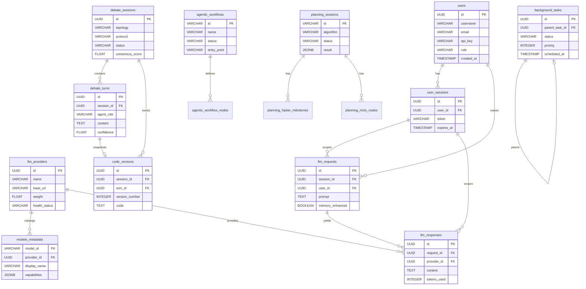

# HelixAgent Database Schema Guide

## Overview

HelixAgent uses PostgreSQL 15+ with the `uuid-ossp` and `pgvector` extensions.
The schema is organized into functional domains and applied in numbered migration order.

---

## ER Diagram (Core Tables)



---

## Migration Order

Apply schema files in the following order for a fresh installation.
The `complete_schema.sql` file merges all of these into one executable script.

| Step | File | Source Migration(s) | Domain |
|------|------|---------------------|--------|
| 1 | `users_sessions.sql` | 001 | Authentication & session management |
| 2 | `llm_providers.sql` | 001, 002 | Provider registry & model catalog |
| 3 | `requests_responses.sql` | 001 | Request/response lifecycle |
| 4 | `cognee_memories.sql` | 001 | RAG memory storage |
| 5 | `protocol_support.sql` | 003 | MCP, LSP, ACP, embeddings, vectors |
| 6 | `background_tasks.sql` | 011 | Async task queue |
| 7 | `indexes_views.sql` | 012, 013 | Performance indexes & materialized views |
| 8 | `debate_system.sql` | 014 | Debate round logging |
| 9 | `debate_sessions.sql` | — | Debate session lifecycle |
| 10 | `debate_turns.sql` | — | Granular debate turn records |
| 11 | `code_versions.sql` | — | Code snapshots at debate milestones |
| 12 | `conversation_context.sql` | — | Infinite context & Kafka event sourcing |
| 13 | `cross_session_learning.sql` | — | Cross-session learned patterns |
| 14 | `distributed_memory.sql` | — | CRDT multi-node memory sync |
| 15 | `streaming_analytics.sql` | — | Kafka Streams real-time analytics |
| 16 | `agentic_workflows.sql` | — | Agentic workflow execution |
| 17 | `planning_sessions.sql` | — | AI planning algorithm results |
| 18 | `llmops_experiments.sql` | — | LLMOps experiments & prompt versions |
| 19 | `relationships.sql` | — | Documentation only (no DDL) |
| — | `clickhouse_analytics.sql` | — | ClickHouse only (separate engine) |

> `complete_schema.sql` is the authoritative single-file reference and can be
> applied directly to a fresh PostgreSQL instance instead of the individual files.

---

## Naming Conventions

| Element | Convention | Example |
|---------|-----------|---------|
| Table names | `snake_case`, plural | `llm_providers`, `debate_turns` |
| Column names | `snake_case` | `provider_id`, `created_at` |
| Primary keys | `id` (UUID or SERIAL) | `id UUID PRIMARY KEY DEFAULT uuid_generate_v4()` |
| Foreign keys | `<referenced_table_singular>_id` | `provider_id`, `session_id`, `user_id` |
| Timestamps | `created_at`, `updated_at`, `completed_at` | always `TIMESTAMP WITH TIME ZONE` |
| Soft-delete | `deleted_at` (nullable) | NULL = active, non-NULL = deleted |
| Status enums | `VARCHAR(32)` or ENUM type | `'pending'`, `'running'`, `'completed'` |
| JSONB blobs | singular noun | `config`, `input`, `result`, `metadata` |
| Indexes | `idx_<table>_<columns>` | `idx_llm_requests_session_id` |
| Unique constraints | `uq_<table>_<column>` | `uq_users_email` |
| FK constraints | `fk_<column>` | `fk_provider`, `fk_model` |

---

## Table Descriptions

### Core Identity & Auth

- **`users`** — Registered user accounts with API keys and roles (`user`, `admin`).
- **`user_sessions`** — Authenticated sessions with expiry tokens, linked to users.
- **`user_preferences`** — Per-user preference key-value store.

### LLM Providers & Models

- **`llm_providers`** — Registry of all 43 configured LLM providers with health status and ensemble weight.
- **`models_metadata`** — Model catalog synchronized from provider APIs and Models.dev, with capability metadata.
- **`model_benchmarks`** — Benchmark scores per model (accuracy, speed, cost) for provider selection.
- **`models_refresh_history`** — Audit log of model catalog refresh operations.

### Requests & Responses

- **`llm_requests`** — Every LLM completion request with prompt, message history, and ensemble config.
- **`llm_responses`** — Provider responses including content, token counts, latency, and confidence scores.

### Memory & Knowledge

- **`cognee_memories`** — Cognee RAG memory entries organized by dataset for namespace isolation.
- **`memory_nodes`** — Nodes in the distributed memory graph.
- **`memory_events`** — Event-sourced memory change log for CRDT-based multi-node sync.
- **`memory_snapshots`** — Point-in-time snapshots of memory state for recovery.
- **`memory_conflicts`** — Detected conflicts between memory nodes awaiting resolution.

### Debate System

- **`debate_logs`** (in `debate_system.sql`) — Append-only log of every participant action in every debate round.
- **`debate_sessions`** — Session-level metadata: topology, protocol, status, consensus score, approval gate state.
- **`debate_turns`** — Granular per-agent turn records with content, confidence, tool calls, and Reflexion memory.
- **`code_versions`** — Code snapshots captured at key debate milestones, with quality metrics and diffs.

### Protocols

- **`mcp_servers`** — MCP (Model Context Protocol) server configurations and health status.
- **`lsp_servers`** — LSP (Language Server Protocol) server configs for code intelligence.
- **`acp_servers`** — ACP (Agent Communication Protocol) server registration.
- **`embedding_config`** — Embedding provider configuration and model mappings.
- **`vector_documents`** — Vector-indexed document chunks for semantic search (pgvector).
- **`protocol_cache`** — Shared response cache for protocol operations.
- **`protocol_metrics`** — Per-operation latency and throughput metrics for protocol servers.

### Background Tasks

- **`background_tasks`** — Durable task queue with priority, retry, and resource limit tracking.
- **`background_tasks_dead_letter`** — Tasks that exceeded max retries, preserved for analysis.
- **`task_execution_history`** — Execution log per task run with resource usage data.
- **`task_resource_snapshots`** — Point-in-time CPU/memory snapshots during task execution.
- **`webhook_deliveries`** — Webhook delivery attempts and response status for task events.

### Conversation Context

- **`conversation_events`** — Event pointers for infinite context (actual payloads in Kafka).
- **`conversation_snapshots`** — Compressed conversation state snapshots.
- **`conversation_compressions`** — LLM-based compression records with token reduction metrics.
- **`conversation_context_cache`** — Cached reconstructed contexts to avoid replay overhead.

### Cross-Session Learning

- **`learned_patterns`** — Recurring patterns detected across debate sessions (intent, strategy, entity co-occurrence).
- **`learned_insights`** — High-level insights distilled from multiple patterns.
- **`knowledge_accumulation`** — Aggregated domain knowledge built over time.
- **`learning_statistics`** — Per-session learning metrics (patterns detected, insights generated).

### Agentic Workflows

- **`agentic_workflows`** — Top-level workflow definitions with config, input, and execution results.
- **`agentic_workflow_nodes`** — Individual nodes in the workflow graph with execution state.
- **`agentic_workflow_edges`** — Directed edges between workflow nodes with condition expressions.

### Planning

- **`planning_sessions`** — Top-level planning invocations specifying algorithm (`hiplan`, `mcts`, `tot`).
- **`planning_hiplan_milestones`** — Hierarchical milestones produced by HiPlan algorithm runs.
- **`planning_mcts_nodes`** — Monte Carlo Tree Search node tree with visit counts and scores.

### LLMOps

- **`llmops_experiments`** — A/B experiment definitions with variant configs and aggregate metrics.
- **`llmops_evaluations`** — Evaluation runs measuring model quality on defined datasets.
- **`llmops_prompt_versions`** — Versioned prompt templates with performance tracking.

### Analytics & Observability

- **`indexes_views.sql`** — Concurrent indexes on hot query paths plus materialized views for dashboards.
- **`provider_performance`** — Aggregated provider latency, error rate, and cost metrics.
- **`system_health`** — Time-series health check results for all services.
- **`conversation_analytics`** / **`conversation_metrics`** — Per-conversation statistics.
- **`streaming_analytics.sql`** — Kafka Streams real-time state: `conversation_state_snapshots`, `stream_entities`, `conversation_flow_patterns`.
- **`clickhouse_analytics.sql`** — ClickHouse-specific tables for debate metrics and provider stream metrics (separate database engine).

---

## Extensions Required

```sql
CREATE EXTENSION IF NOT EXISTS "uuid-ossp";   -- UUID generation
CREATE EXTENSION IF NOT EXISTS "pgvector";    -- Vector similarity search
CREATE EXTENSION IF NOT EXISTS "pgcrypto";    -- Additional crypto functions
```

---

## See Also

- [README.md](README.md) — Schema file index
- `internal/services/boot_manager.go` — Automated schema application on startup
- `internal/database/` — Go repository layer over these tables
