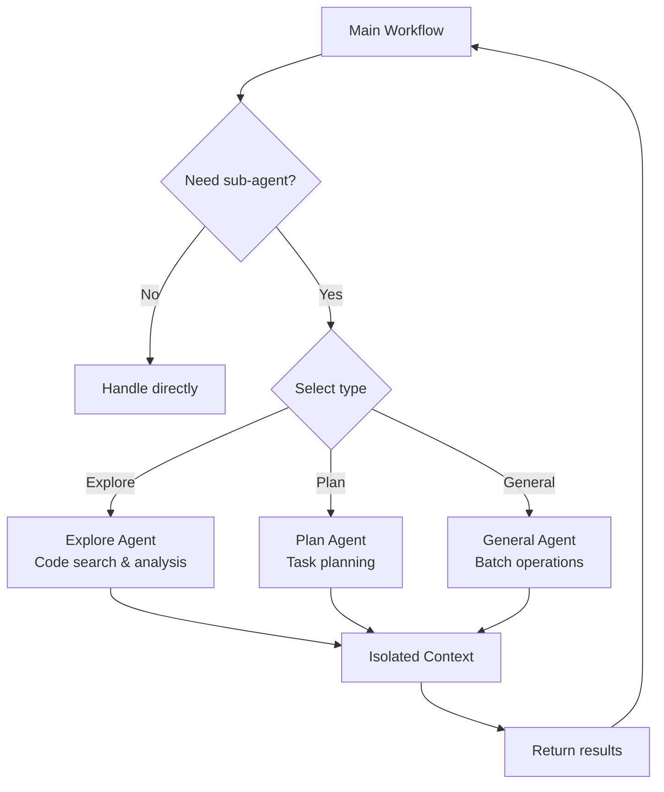

# Comprehensive Tools Analysis Report
## MayDay-wpf Tool Ecosystem - Integration Assessment

**Date:** 2026-04-03  
**Analyst:** HelixAgent Team  
**Scope:** Snow CLI, Think, SearchForYou, AIBotPublic  

---

## Executive Summary

| Tool | Type | Language | Stars | Status | Integration Recommendation |
|------|------|----------|-------|--------|---------------------------|
| **Snow CLI** | CLI Agent | TypeScript | 541 | ✅ Active | **SUBMODULE** - Full integration |
| **Think** | Desktop App | Vue.js/Electron | N/A | ⚠️ Beta | **ANALYZE** - Extract features |
| **SearchForYou** | Web Search | Vue.js/ASP.NET | N/A | ⚠️ Beta | **PORT** - Core capabilities |
| **AIBotPublic** | AI Platform | .NET 8 | N/A | ⚠️ Active | **ANALYZE** - Architecture study |

---

## 1. Snow CLI - Deep Analysis

### Overview
**Repository:** `tools/snow-cli` (git@github.com:MayDay-wpf/snow-cli.git)  
**NPM Package:** `snow-ai`  
**Version:** 0.7.6  
**License:** MIT  
**Website:** https://snowcli.com  

### Core Capabilities

#### 1.1 Multi-Provider Support
```typescript
// From source/api/
- anthropic.ts    // Claude API integration
- gemini.ts       // Google Gemini API
- chat.ts         // Generic chat interface
- embedding.ts    // Embedding services
- models.ts       // Model management
- sse-server.ts   // SSE service mode
```

**Supported Providers:**
- OpenAI (GPT-4o, o1, o3)
- Anthropic (Claude 3.5/3.7 Sonnet, Opus, Haiku)
- Google (Gemini 2.5/3)
- DeepSeek (V3, R1)
- Kimi (Moonshot AI)
- Zhipu (GLM)
- And more via custom configuration

#### 1.2 Sub-Agent Architecture
Snow CLI implements a sophisticated sub-agent system:



**Key Feature:** Context isolation - sub-agents run in isolated contexts to preserve main workflow tokens.

#### 1.3 Command System (Slash Commands)

**Session Management:**
| Command | Function |
|---------|----------|
| `/clear` | Clear conversation |
| `/resume` | Resume historical session |
| `/export` | Export conversation |
| `/compact` | Compress conversation history |
| `/copy-last` | Copy last AI response |

**Mode Switching:**
| Command | Function |
|---------|----------|
| `/yolo` | Auto-approve mode |
| `/plan` | Planning mode |
| `/vulnerability-hunting` | Security analysis mode |
| `/tool-search` | On-demand tool discovery |

**Code Operations:**
| Command | Function |
|---------|----------|
| `/review` | Interactive code review |
| `/diff` | Diff view for changes |
| `/init` | Generate AGENTS.md |
| `/reindex` | Rebuild codebase index |
| `/codebase` | Manage codebase indexing |

**Advanced Features:**
| Command | Function |
|---------|----------|
| `/mcp` | MCP service management |
| `/skills` | Skill template creation |
| `/custom` | Custom commands |
| `/worktree` | Git branch management |
| `/btw` | Side-channel Q&A |
| `/agent-` | Sub-agent selection |

#### 1.4 MCP (Model Context Protocol) Integration

**Configuration:** `~/.snow/mcp-config.json`
```json
{
  "mcpServers": {
    "filesystem": {
      "type": "stdio",
      "command": "npx",
      "args": ["-y", "@modelcontextprotocol/server-filesystem", "/path"],
      "timeout": 600000
    },
    "github": {
      "type": "local",
      "command": "npx",
      "args": ["-y", "@modelcontextprotocol/server-github"],
      "environment": {"GITHUB_TOKEN": "token"}
    },
    "remote": {
      "type": "http",
      "url": "https://api.example.com/mcp",
      "headers": {"Authorization": "Bearer ${API_KEY}"}
    }
  }
}
```

**Transport Types:**
- `stdio`: Local subprocess (STDIO mode)
- `local`: Alias for stdio
- `http`: Remote HTTP service

#### 1.5 Codebase Indexing

**Features:**
- Vector-based code search
- File watching for real-time updates
- Embedding-based semantic search
- Integration with multiple embedding providers

**Configuration:**
```json
{
  "codebase": {
    "enabled": true,
    "embeddingProvider": "openai",
    "excludePatterns": ["node_modules", ".git"],
    "includePatterns": ["*.ts", "*.tsx", "*.js"]
  }
}
```

#### 1.6 LSP (Language Server Protocol) Integration

**Capabilities:**
- Go to definition
- Find references
- Semantic search
- Code outline

**ACE Tools:**
- `ace-find_definition`
- `ace-semantic_search`
- `ace-get_outline`

#### 1.7 Headless Mode
```bash
# Direct command execution
snow -p "Explain this code" --headless

# Async task execution
snow --async "Refactor this function"

# SSE service mode
snow --sse-server --port 8080
```

#### 1.8 Team Mode
Multi-agent collaboration:
- Parallel task execution
- Agent communication
- Shared context

### Architecture Analysis

```
snow-cli/
├── source/
│   ├── agents/          # AI agents (review, codebase, summary)
│   ├── api/             # LLM API adapters
│   ├── hooks/           # React hooks for conversation
│   │   └── conversation/
│   │       ├── chatLogic/      # Chat logic handlers
│   │       ├── core/           # Core conversation logic
│   │       └── utils/          # Utilities
│   ├── mcp/             # MCP protocol implementation
│   ├── prompt/          # System prompt templates
│   ├── types/           # TypeScript types
│   ├── ui/              # UI components (Ink-based)
│   └── utils/           # Utility functions
├── JetBrains/           # JetBrains plugin
├── VSIX/                # VSCode extension
└── docs/                # Documentation
```

### Key Dependencies

**Core:**
- `@modelcontextprotocol/sdk`: MCP protocol
- `@agentclientprotocol/sdk`: Agent protocol
- `ink`: React-based CLI UI
- `react`: UI framework

**APIs:**
- `node-fetch`: HTTP requests
- `ws`: WebSocket support
- `eventsource`: SSE support
- `@microsoft/signalr`: Real-time communication

**File Processing:**
- `pdf-parse`: PDF parsing
- `mammoth`: Word documents
- `xlsx`: Excel files
- `pptx-parser`: PowerPoint
- `sharp`: Image processing (optional)

**Utilities:**
- `tiktoken`: Token counting
- `diff`: Diff generation
- `chokidar`: File watching
- `ssh2`: SSH connections

### Code Quality Assessment

**Strengths:**
- ✅ TypeScript with strict typing
- ✅ Comprehensive documentation (48 markdown files)
- ✅ Modular architecture
- ✅ React-based UI (Ink)
- ✅ Proper error handling
- ✅ Multi-platform support

**Areas for Improvement:**
- ⚠️ No unit tests visible
- ⚠️ Complex hook structure
- ⚠️ Some files are very large (cli.tsx: 20KB)

### Integration Strategy

**Decision:** ✅ ADD AS SUBMODULE

**Rationale:**
1. Active development (last updated 2026-04-03)
2. MIT license (permissive)
3. Well-documented
4. Complements HelixAgent's CLI agent collection
5. Unique features: Sub-agent system, MCP integration, LSP support

**Integration Plan:**
1. Add as submodule in `tools/snow-cli` ✅ DONE
2. Study sub-agent architecture for HelixAgent integration
3. Port MCP integration patterns
4. Extract codebase indexing approach
5. Adapt command system for HelixAgent

---

## 2. Think - Desktop LLM Client

### Overview
**Repository:** https://github.com/MayDay-wpf/Think  
**Type:** Desktop application (macOS, Windows, Linux)  
**Tech Stack:** Vue.js + Electron  

### Capabilities Analysis

**From README:**
- ✅ Basic UI
- ✅ Web Search
- ✅ Chat
- ✅ Images Chat
- ✅ Files Chat
- ✅ Settings
- ✅ Statistics
- ⏳ Image Generation (planned)
- ⏳ Plugin by function calling (planned)
- ⏳ Knowledge (planned)

**Supported Providers:**
- OpenAI
- DeepSeek
- Ollama
- Anthropic
- Gemini
- Qwen
- DouBao
- Zhipu
- Wenxin
- Hunyuan
- SiliconFlow

### Integration Assessment

**Decision:** ⚠️ ANALYZE & EXTRACT FEATURES

**Rationale:**
- Desktop app (not CLI-based)
- Vue.js/Electron (different tech stack)
- Overlaps with Snow CLI functionality
- Good for UI/UX pattern study

**Extractable Features:**
1. Multi-provider UI pattern
2. File chat implementation
3. Statistics tracking
4. Settings management UI

---

## 3. SearchForYou - LLM Web Search

### Overview
**Repository:** https://github.com/MayDay-wpf/SearchForYou  
**Description:** "A networked search website based on LLM AI"  
**Tech Stack:** Vue.js + ASP.NET Core 6  
**Live Demo:** https://q.embbot.com/

### Capabilities Analysis

**From README (decoded):**
- AI-powered web search
- Based on Vue 3 + Pinia + ASP.NET Core 6
- Entity Framework Core
- Axios for HTTP
- Responsive design

### Integration Assessment

**Decision:** 🔧 PORT CORE CAPABILITIES

**Rationale:**
- Web-based (not CLI)
- ASP.NET backend (different stack)
- Search functionality is valuable
- Should be integrated as a tool/adapter

**Porting Plan:**
1. Extract search orchestration logic
2. Study result ranking/summarization
3. Implement as HelixAgent search tool
4. Add to MCP adapters

---

## 4. AIBotPublic - AI Aggregation Platform

### Overview
**Repository:** https://github.com/MayDay-wpf/AIBotPublic  
**Description:** "AIBot PRO is a .NET 8-based AI aggregation client"  
**Tech Stack:** .NET 8  
**Features:**
- Multi-AI product integration (ChatGPT, Gemini, Claude, etc.)
- Knowledge base support
- Plugin development
- AI workflow engine
- Open platform for custom AI APIs

### Capabilities Analysis

**Key Features:**
1. **AI Aggregation:** Unified interface for multiple providers
2. **Knowledge Base:** Document Q&A system
3. **Plugin System:** Extensible architecture
4. **Workflow Engine:** AI process automation
5. **Open Platform:** Custom API output

### Integration Assessment

**Decision:** 📊 ARCHITECTURE STUDY

**Rationale:**
- .NET 8 (different tech stack)
- Complex platform (not CLI tool)
- Good architectural patterns
- Plugin system design is valuable

**Study Areas:**
1. Multi-provider abstraction layer
2. Plugin architecture
3. Workflow engine design
4. Knowledge base implementation

---

## Integration Summary

### Immediate Actions (This Week)

1. ✅ **Snow CLI** - Added as submodule
2. 🔄 **Analyze** Snow CLI source code for porting:
   - Sub-agent system
   - MCP integration
   - Command system
   - Codebase indexing

### Short-term (Next 2 Weeks)

3. **Port SearchForYou capabilities:**
   - Web search integration
   - Result summarization
   - Add to MCP adapters

4. **Study AIBotPublic:**
   - Plugin architecture
   - Workflow engine patterns
   - Document for HelixAgent design

### Medium-term (Next Month)

5. **Extract Think features:**
   - UI patterns for HelixAgent web interface
   - File chat implementation
   - Statistics tracking

6. **Deep integration of Snow CLI:**
   - Bridge Snow CLI agents to HelixAgent
   - Share codebase indexing
   - Unified MCP configuration

---

## Technical Debt & Risks

### Snow CLI Integration Risks

| Risk | Severity | Mitigation |
|------|----------|------------|
| Node.js dependency | Medium | Containerize or use npx |
| React/Ink UI | Low | Terminal UI is isolated |
| Configuration conflict | Medium | Namespace configs under `.snow/` |
| License compatibility | Low | MIT is compatible |

### Porting Challenges

| Feature | Source | Complexity |
|---------|--------|------------|
| Sub-agent system | Snow CLI | High |
| MCP integration | Snow CLI | Medium |
| Codebase indexing | Snow CLI | Medium |
| Web search | SearchForYou | Low |
| Plugin system | AIBotPublic | High |

---

## Recommendations

### 1. Snow CLI (Priority: HIGH)
- ✅ Add as submodule (DONE)
- Study sub-agent architecture
- Port MCP client implementation
- Integrate command system

### 2. Search Capabilities (Priority: HIGH)
- Port from SearchForYou
- Implement as MCP tool
- Add to HelixAgent tool registry

### 3. Plugin Architecture (Priority: MEDIUM)
- Study AIBotPublic design
- Design HelixAgent plugin system
- Implement plugin loader

### 4. Desktop UI Patterns (Priority: LOW)
- Study Think implementation
- Document for future web UI
- Extract settings management

---

## Next Steps

1. ✅ Add snow-cli submodule to `tools/`
2. Create detailed porting plan for sub-agent system
3. Implement web search MCP adapter
4. Document architecture patterns from AIBotPublic
5. Schedule integration testing

---

**Report Status:** ✅ Complete  
**Last Updated:** 2026-04-03  
**Next Review:** 2026-04-10
